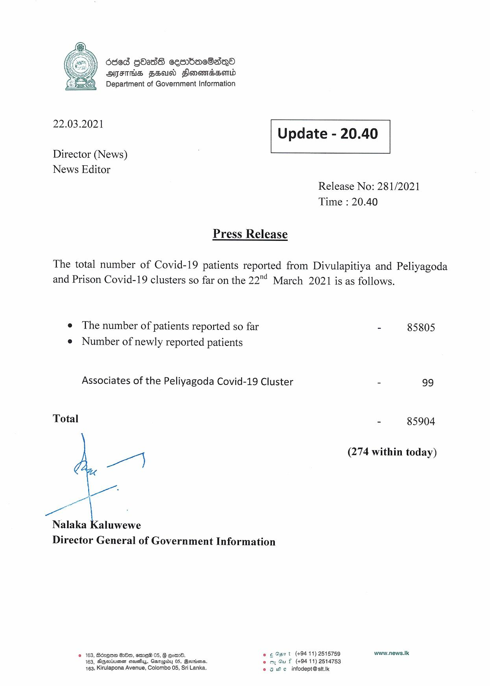

# Press Release - 2021.03.22 
Key: 440ca7f1804792a1be3d206b6cffce2c 

---
```
   

6d68 gbadS cesrbac8ad~qo
s yy AMFITHS FSU Flomomnssomd
Department of Government Information

 

22.03.2021 Update - 20.40

 

 

 

Director (News)

News Editor
Release No: 281/2021
Time : 20.40

Press Release

The total number of Covid-19 patients reported from Divulapitiya and Peliyagoda
and Prison Covid-19 clusters so far on the 22"! March 2021 is as follows.

e The number of patients reported so far - 85805
e Number of newly reported patients

Associates of the Peliyagoda Covid-19 Cluster - 99

Total - 85904

7 (274 within today)
Ln

—t
Nalaka Kaluwewe

Director General of Government Information

© 163, B6zQ6H 800, ema 05, G Eomnd. © ¢ Gs t (+9411) 2515759 www.news.Ik
163, AgGaiumar cevays, Ganapiby 05, Goorin. eo oy Gu f (494 11) 2514753
+163, Kirulapona Avenue, Colombo 05, Sri Lanka. © oe. infodept@stt.k

```
