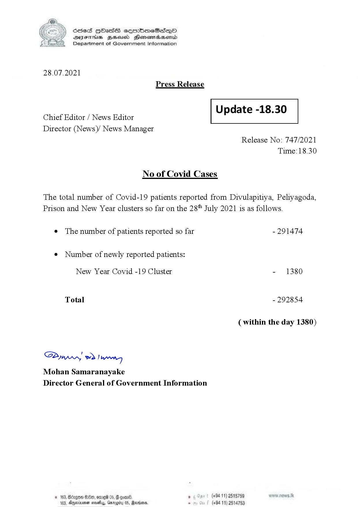

# Press Release - 2021.07.28 
Key: 4474fd6bfd3172e8bcce6618a6f97e72 

---
```
S) ScseS HOasdS cerrbmeSdQo
DFTs BHEosd Henewtaeasernid
Department of Government Information

 

28.07.2021
Press Release

 

Update -18.30

 

 

Chief Editor / News Editor
Director (News)/ News Manager

 

Release No: 747/2021
Time: 18.30

No of Covid Cases

The total number of Covid-19 patients reported from Divulapitiya, Peliyagoda,
Prison and New Year clusters so far on the 28" July 2021 is as follows.

¢ The number of patients reported so far - 291474
¢ Number of newly reported patients:

New Year Covid -19 Cluster - 1380

Total - 292854

(within the day 1380)

Sw 2) wn
Mohan Samaranayake
Director General of Government Information

© 163, Bdogon $00, ome 0 p. . (+9411) 2515759
103, Agere nays, Garey 05, Rardin . (+94 11) 2514753

 
 

```
