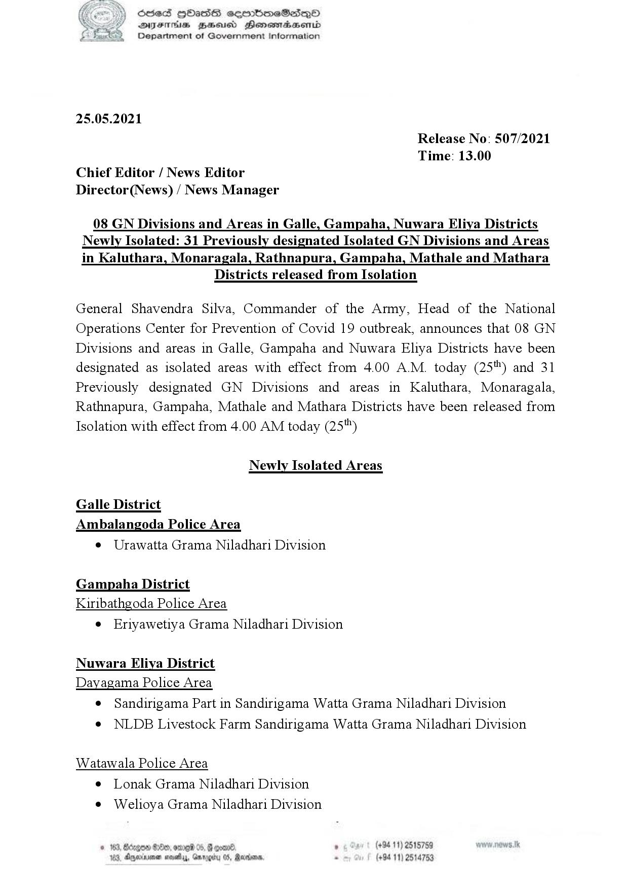

# Press Release - 2021.05.25 - Released from isolation and newly isolated areas 
Key: 44e882f3b3befb23eb84b344ae72b053 

---
```
ie ) Sed HOHass cermbmeSadqQoO
SY Suerte Beeusd Henesraasond
‘2 Department of Government Information

 

25.05.2021

Release No: 507/2021
Time: 13.00

Chief Editor / News Editor

Director(News) / News Manager

08 GN Divisions and Areas in Galle, Gampaha, Nuwara Eliya Districts
Newly Isolated: 31 Previously designated Isolated GN Divisions and Areas
in Kaluthara, Monaragala, Rathnapura, Gampaha, Mathale and Mathara

Districts released from Isolation

General Shavendra Silva, Commander of the Army, Head of the National
Operations Center for Prevention of Covid 19 outbreak, announces that 08 GN
Divisions and areas in Galle, Gampaha and Nuwara Eliya Districts have been
designated as isolated areas with effect from 4.00 A.M. today (25") and 31
Previously designated GN Divisions and areas in Kaluthara, Monaragala,
Rathnapura, Gampaha, Mathale and Mathara Districts have been released from
Isolation with effect from 4.00 AM today (25")

Newly Isolated Areas

Galle District

Ambalangoda Police Area
¢ Urawatta Grama Niladhari Division

Gampaha District
Kiribathgoda Police Area
e Eriyawetiya Grama Niladhari Division

Nuwara Eliya District
Dayagama Police Area
¢ Sandirigama Part in Sandirigama Watta Grama Niladhari Division

@ NLDB Livestock Farm Sandirigama Watta Grama Niladhari Division

Watawala Police Area
¢ Lonak Grama Niladhari Division
¢ Welioya Grama Niladhari Division

© 163, Borgo 800, ore 05, g

103, Ageriuenen sevethys, Qs

     

Raxms,

 

```
