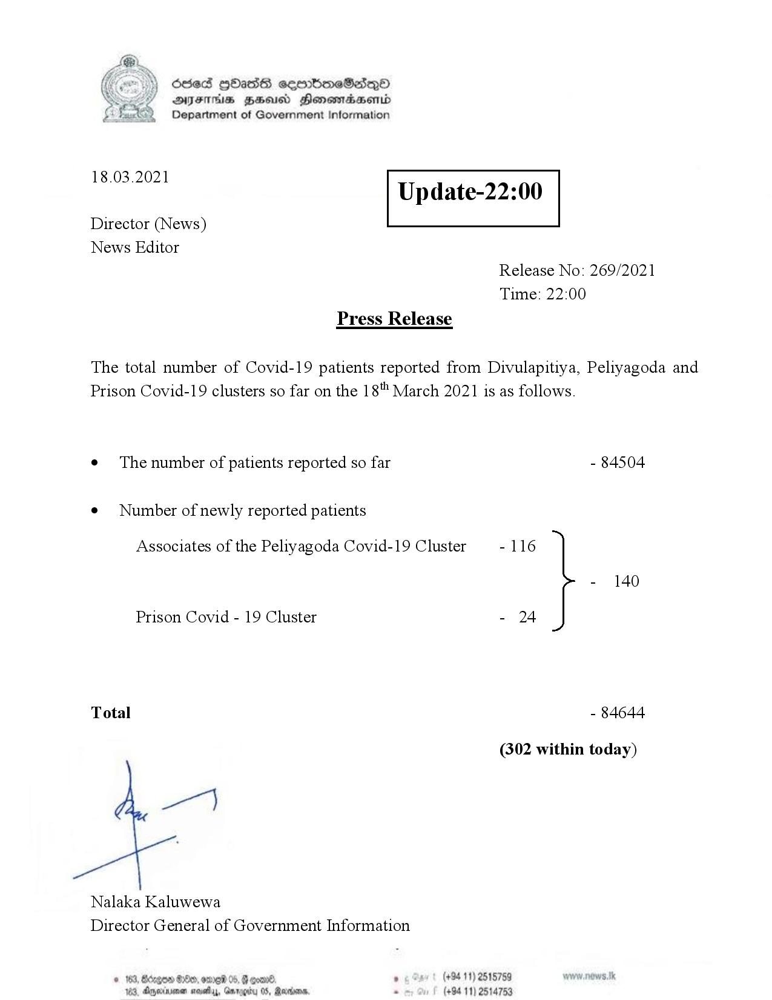

# Press Release - 2021.03.18 
Key: 4546a681da4a12cb7617d22622e9b4de 

---
```
>) Sed HOadS ceorbmeSedeQ®
DAIS BHU Honomasentd
Department of Government Information

 

 

18.03.2021

Update-22:00

 

 

 

Director (News)

News Editor
Release No: 269/2021

Time: 22:00
Press Release

The total number of Covid-19 patients reported from Divulapitiya, Peliyagoda and
Prison Covid-19 clusters so far on the 18" March 2021 is as follows.
e¢ The number of patients reported so far - 84504

¢ Number of newly reported patients

Associates of the Peliyagoda Covid-19 Cluster - 116

- 140
Prison Covid - 19 Cluster - 24
Total - 84644
(302 within today)

we)

Nalaka Kaluwewa
Director General of Government Information

© 183, Borgo 200, ome 05, @ ooar® , (+94 11) 2518789
183, Aqeinuner sevethy, Garogiry 05, Reena. - (+94 11) 2514753

```
