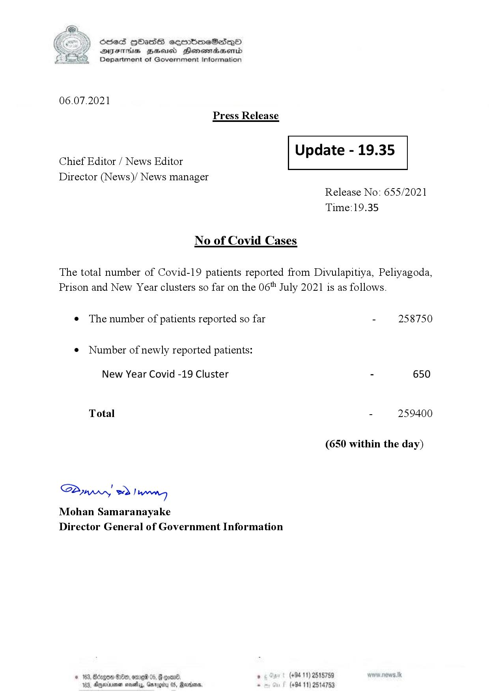

# Press Release - 2021.07.06 
Key: 4587c223a3a20e6206900767824b9ad5 

---
```
S) ScseS HOasdS cerrbmeSdQo
SVsThis geod Henssnadasombd
Department of Government Information

 

06.07.2021
Press Release

 

Update - 19.35

 

 

Chief Editor / News Editor
Director (News)/ News manager

 

Release No: 655/2021
Time:19.35

No of Covid Cases

The total number of Covid-19 patients reported from Divulapitiya, Peliyagoda,
Prison and New Year clusters so far on the 06" July 2021 is as follows.

e The number of patients reported so far - 258750

¢ Number of newly reported patients:

New Year Covid -19 Cluster - 650
Total - 259400
(650 within the day)

Saw 2) wn
Mohan Samaranayake
Director General of Government Information

© 163, Ded, omg 0 a0 . (+94 11) 2515759
183, Aperiaimen mavetyy, Garogiby 05, Rarer, - (+94 11) 2514753

```
