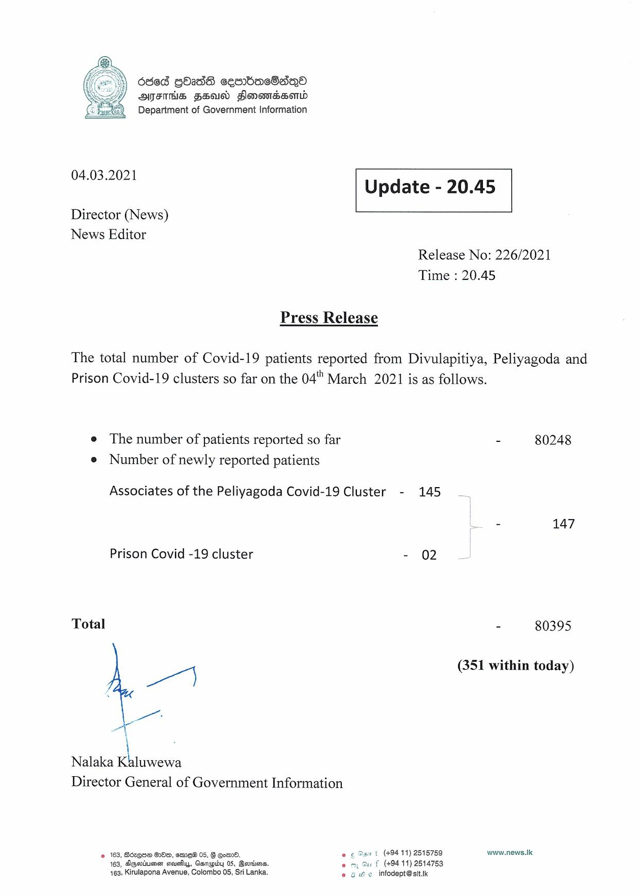

# Press Release - 2021.03.04 
Key: 461ae16f059fef63dec7d529112f9bf6 

---
```
6d6d gbadS cembac8sqQo
OMFS Fea Flonawdhsond
Department of Government Information

 

 

04.03.2021 Update - 20.45

 

 

 

Director (News)

News Editor
Release No: 226/2021
Time : 20.45

Press Release

The total number of Covid-19 patients reported from Divulapitiya, Peliyagoda and
Prison Covid-19 clusters so far on the 04" March 2021 is as follows.

e The number of patients reported so far - 80248
e Number of newly reported patients

Associates of the Peliyagoda Covid-19 Cluster - 145
- 147

Prison Covid -19 cluster - 02

Total - 80395

(351 within today)

 

Nalaka Giwsene
Director General of Government Information

 

© 163, Bézque HOO, sme 05, G Com. eo ¢ San t (49411) 2515759 www.news.Ik
163, Agsriuussn ceusiuy, Gsmapiby 05, Bartiens. (494 11) 2514753
163, Kirulapona Avenue, Colombo 05, Sri Lanka. © 3 He infodept@sit.ik

 

```
