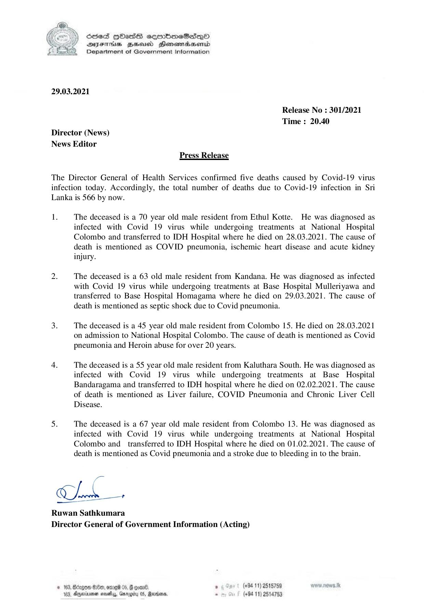

# Press Release - 2021.03.29 - Covid 19 infection deaths 
Key: 4622aec9e65332efca9a1053414475e7 

---
```
6856S HHass sermbmeSasqo
DFTs BHEosd Henewtaeasernid
Department of Government Information

 

29.03.2021

Release No : 301/2021
Time : 20.40
Director (News)
News Editor
Press Release

The Director General of Health Services confirmed five deaths caused by Covid-19 virus
infection today. Accordingly, the total number of deaths due to Covid-19 infection in Sri
Lanka is 566 by now.

1. The deceased is a 70 year old male resident from Ethul Kotte. He was diagnosed as
infected with Covid 19 virus while undergoing treatments at National Hospital
Colombo and transferred to IDH Hospital where he died on 28.03.2021. The cause of
death is mentioned as COVID pneumonia, ischemic heart disease and acute kidney
injury.

of The deceased is a 63 old male resident from Kandana. He was diagnosed as infected
with Covid 19 virus while undergoing treatments at Base Hospital Mulleriyawa and
transferred to Base Hospital Homagama where he died on 29.03.2021. The cause of
death is mentioned as septic shock due to Covid pneumonia.

3. The deceased is a 45 year old male resident from Colombo 15. He died on 28.03.2021
on admission to National Hospital Colombo. The cause of death is mentioned as Covid
pneumonia and Heroin abuse for over 20 years.

  

4, The deceased is a 55 year old male resident from Kaluthara South. He was diagnosed as
infected with Covid 19 virus while undergoing treatments at Base Hospital
Bandaragama and transferred to IDH hospital where he died on 02.02.2021. The cause
of death is mentioned as Liver failure, COVID Pneumonia and Chronic Liver Cell
Disease.

5: The deceased is a 67 year old male resident from Colombo 13. He was diagnosed as
infected with Covid 19 virus while undergoing treatments at National Hospital
Colombo and _ transferred to IDH Hospital where he died on 01.02.2021. The cause of
death is mentioned as Covid pneumonia and a stroke due to bleeding in to the brain.

ges

CIh

 

Ruwan Sathkumara
Director General of Government Information (Acting)

© 163, Bcxgon G0e, ome 05, G comnd . (+94 11) 2515759 www, news. tk
103, Anexivenen nosey, Grog 0S, Raroorn, . (+94 11) 2514753

 

 

```
