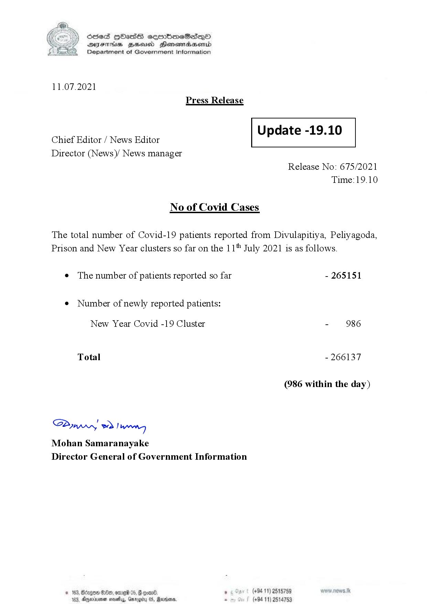

# Press Release - 2021.07.11 
Key: 4647e6bccad75f33c6c85953bb7a941d 

---
```
S) ScseS HOasdS cerrbmeSdQo
DFTs BHEosd Henewtaeasernid
Department of Government Information

 

11.07.2021
Press Release

 

Update -19.10

 

 

Chief Editor / News Editor
Director (News)/ News manager

 

Release No: 675/2021
Time: 19.10

No of Covid Cases

The total number of Covid-19 patients reported from Divulapitiya, Peliyagoda,
Prison and New Year clusters so far on the 11" July 2021 is as follows.

¢ The number of patients reported so far - 265151

¢ Number of newly reported patients:

New Year Covid -19 Cluster - 986

Total - 266137

(986 within the day)

SPywwwy > Ian
Mohan Samaranayake
Director General of Government Information

© 183,8 280, omg 05, @ goad » (+94 11) 2515789
183, Dyernioner novelas, Gmrogity 0S, Marion, . (+94 11) 2514753

 

```
