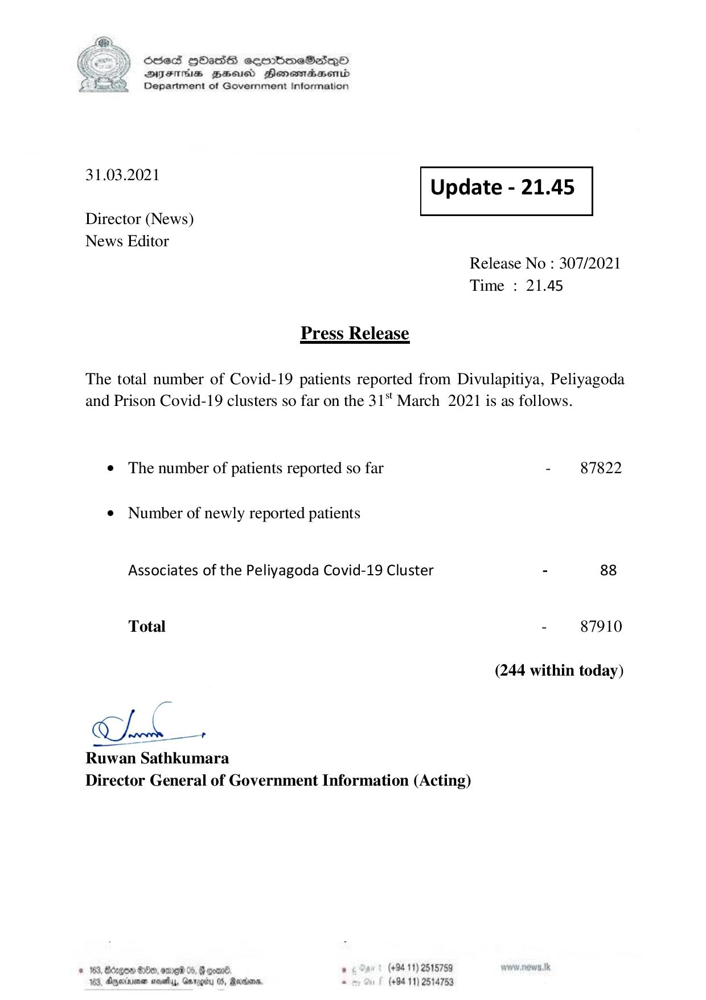

# Press Release - 2021.03.31 
Key: 46d101fad750c4672951567d88722217 

---
```
) ScdeS HOadS cermbmeSsdQo
DVEFIHS HHosd Honomabsenid
Department of Government Information

 

 

31.03.2021

 

Update - 21.45

 

 

Director (News)
News Editor

Release No : 307/2021
Time : 21.45

Press Release

The total number of Covid-19 patients reported from Divulapitiya, Peliyagoda
and Prison Covid-19 clusters so far on the 31 March 2021 is as follows.

¢ The number of patients reported so far

¢ Number of newly reported patients
Associates of the Peliyagoda Covid-19 Cluster

Total

ne +

Ruwan Sathkumara
Director General of Government Information (Acting)

dee: med 8 Beret . (+94 11) 2518759
ae evethy,, Gmrogity 05, Ratan, - (+94 11) 2514753

© 163, Bdrgos

183, Anyox

 

 

- 87822

- 87910

(244 within today)

```
