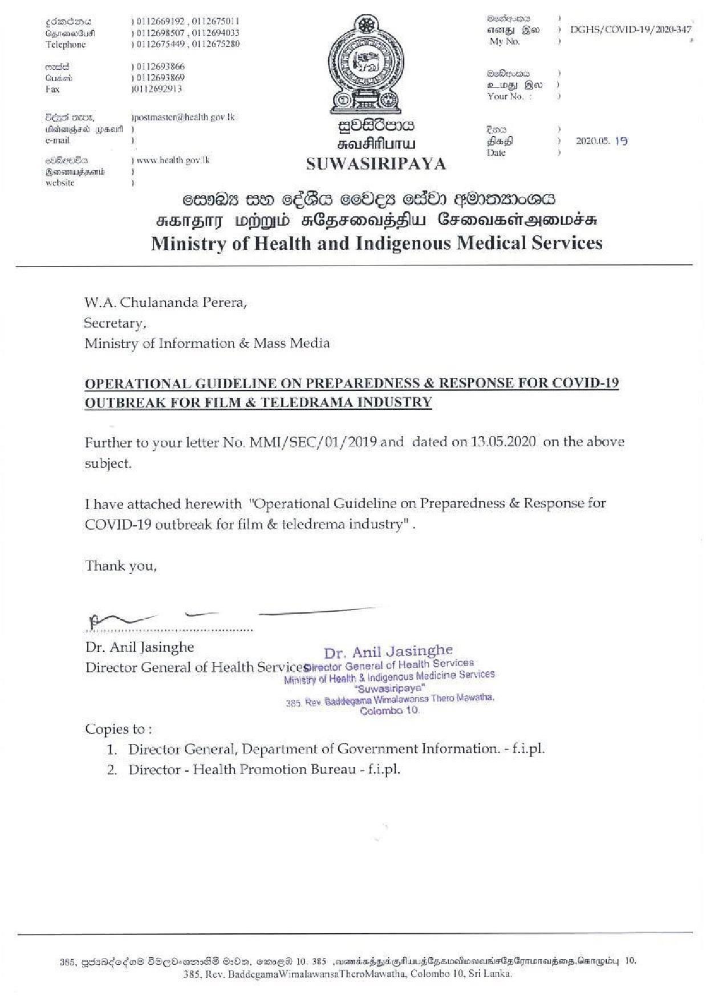

# Press Release - 2020.05.19 - Ministry of Health and Indigenous Medical Services 
Key: 4767dcb06640b8198988a98fb3e9b6af 

---
```
  

gdmcme ) 0112669192 , 0112675011 Beckepurn )
GyrenaoGudl 70112698507 , 0112694033 sg Geo » DGHS/COVID-19/ 2020-347
Felephone }0112675449 , 0112675280 My No. , ’
emit 10112693866
Gudien ) 0112693869 Bebe ’
Fax 0112692913 oon Be)
(oF Your No. : )
Béast aco, )postmastené health gov tk en
allanghasd ypmaifl ) QOBSane Sea )
e-mail ) aeugiMunrw bai } 2020.05. 19
eRe } wow health pov Ik .
eeuera SUWASIRIPAYA
website ’

en0@s wo céBa celles GO) FOoDsI0@a
STH WOMW FCErOUsHW Crmosenoinwss:
Ministry of Health and Indigenous Medical Services

 

W.A. Chulananda Perera,
Secretary,
Ministry of Information & Mass Media

OPERATIONAL GUIDELINE ON PREPAREDNESS & RESPONSE FOR COVID-19
OUTBREAK FOR FILM & TELEDRAMA INDUSTRY

Further to your letter No. MMI/SEC/01/2019 and dated on 13.05.2020 on the above
subject.

[have attached herewith “Operational Guideline on Preparedness & Response for
COVID-19 outbreak for film & teledrema industry" .

Thank you,

 
 

Eoaaccs

Dr. Anil Jasinghe Dr. Anil Jasinghe

Director General of Health Servicesirector General of Health Services
Misigtry of Health & indiganous Medicine Services

“Suwasiripaya”
385, Rev. Baddegema Wimalawansa Thero Mawatha,
Golombo 10.
Copies to:
1. Director General, Department of Government Information. - f.i-pl.
2. Director - Health Promotion Bureau - f.i-pl.

 

385, gRRAdeda® BOCO-amSS G20, emET 10, 385 mombaipdgMuurplpancionanisGsGymorages.Genapiay 10,

385, Rev. BaddegamaWimalawansaTheroMawatha, Colombo 10, Sri Lanka,

```
