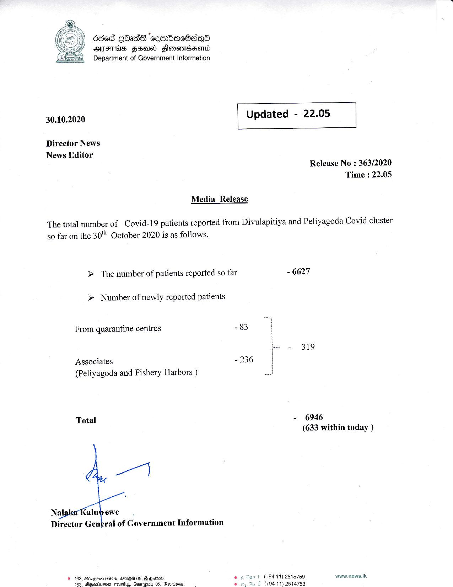

# Press Release - 2020.10.30 
Key: 490725199852d1764021f4e592525238 

---
```
686d GOadS seembUacOdnQo
ATITHS FSAI Flonemsawomd
Department of Government Information

 

 

30.10.2020 Updated - 22.05

 

 

 

Director News
News Editor
Release No : 363/2020
Time : 22.05
Media _ Release

The total number of Covid-19 patients reported from Divulapitiya and Peliyagoda Covid cluster
so far on the 30" October 2020 is as follows.

> The number of patients reported so far - 6627

> Number of newly reported patients

 

From quarantine centres - 83 |
= - 319
Associates - 236 |
(Peliyagoda and Fishery Harbors ) s
Total - 6946
(633 within today )
Director Gengral of Government Information
© 163, Bozqgne Oe, ame 05, G om. | (+94 11) 2515759 ww.news.Ik.

 

163. Aigetiemen soueuy, Gamapibdy 05, @evssens. (494 11) 2514753

```
