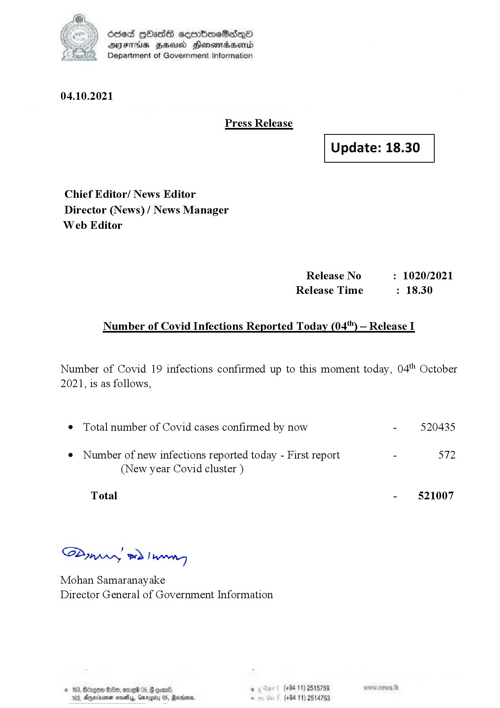

# Press Release - 2021.10.04 
Key: 49ca5541a3d57e793301184a594d69d7 

---
```
(oe) Sed QOass cerrbroeSadqQo
DFS HHS Honsmnadaerntd
Department of Government Information

 

04.10.2021

Press Release

 

Update: 18.30

 

 

 

Chief Editor/ News Editor
Director (News) / News Manager
Web Editor

Release No : 1020/2021
Release Time : 18.30

Number of Covid Infections Reported Today (04'") — Release I

Number of Covid 19 infections confirmed up to this moment today, 04" October
2021, is as follows,

¢ Total number of Covid cases confirmed by now - 520435

¢ Number of new infections reported today - First report - 572
(New year Covid cluster )

Total - 521007

Sa mprn! wd! wong

Mohan Samaranayake
Director General of Government Information

° (+94 11) 2515759
(+94 11) 2514753

 

```
