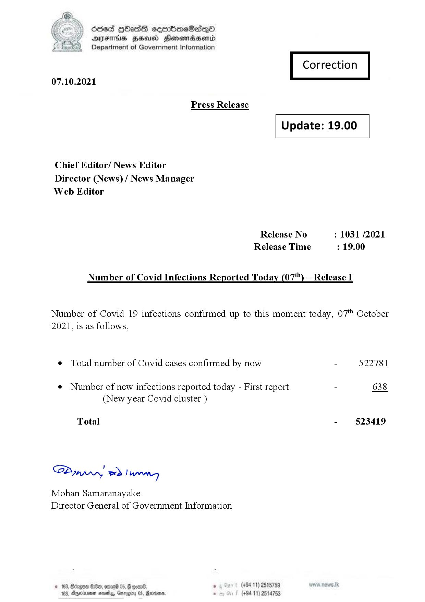

# Press Release  - 2021.10.07 
Key: 4a265458bd09596cd384d743677ae02e 

---
```
fee) Oded [bas cermbmeSadenO
YY DYFHs Head Honondwsend

Department of Government Information
Correction

07.10.2021

 

Press Release

 

Update: 19.00

 

 

 

Chief Editor/ News Editor
Director (News) / News Manager
Web Editor

Release No : 1031 /2021
Release Time : 19.00

Number of Covid Infections Reported Today (07) — Release I

Number of Covid 19 infections confirmed up to this moment today, 07" October
2021, is as follows,

¢ Total number of Covid cases confirmed by now - 522781

¢ Number of new infections reported today - First report - 638
(New year Covid cluster )

-  §23419

Total

Sa mprn! wd! wong

Mohan Samaranayake
Director General of Government Information

(+94 11) 2515759
(+94 11) 2514753

 

```
