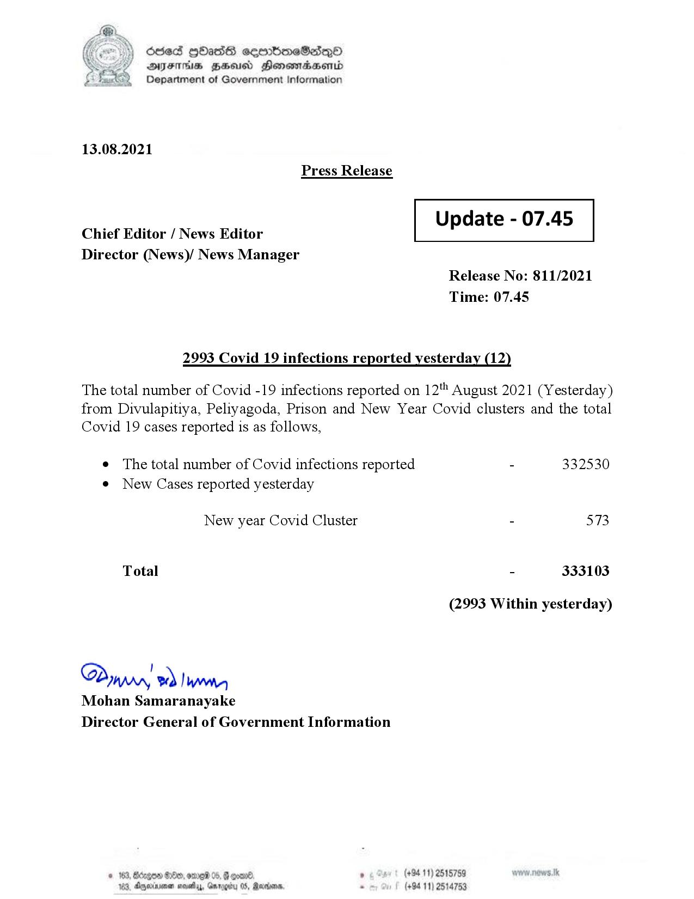

# Press Release  - 2021.08.13 - Yesterday Covid 19 Infection Report 
Key: 4a815245d5969700193daf60b3e31cb5 

---
```
or ) died KOasdSH ceerbneSdqQo
SS AIFS FHA Honowmasenid
M Department of Government Information

 

13.08.2021
Press Release

 

Update - 07.45

 

 

 

Chief Editor / News Editor

Director (News)/ News Manager
Release No: 811/2021

Time: 07.45

2993 Covid 19 infections reported yesterday (12)

The total number of Covid -19 infections reported on 12" August 2021 (Yesterday)
from Divulapitiya, Peliyagoda, Prison and New Year Covid clusters and the total

Covid 19 cases reported is as follows,

e The total number of Covid infections reported - 332530
e New Cases reported yesterday
New year Covid Cluster - 573
Total - 333103
(2993 Within yesterday)
Bias
JAMA, wd lwo,

Mohan Samaranayake
Director General of Government Information

$2800, ore 05, @ goen® (+94 11) 2518759
(+94 11) 2514753

103, Agjerinenen most, Grragity 0S, Marine

 

```
