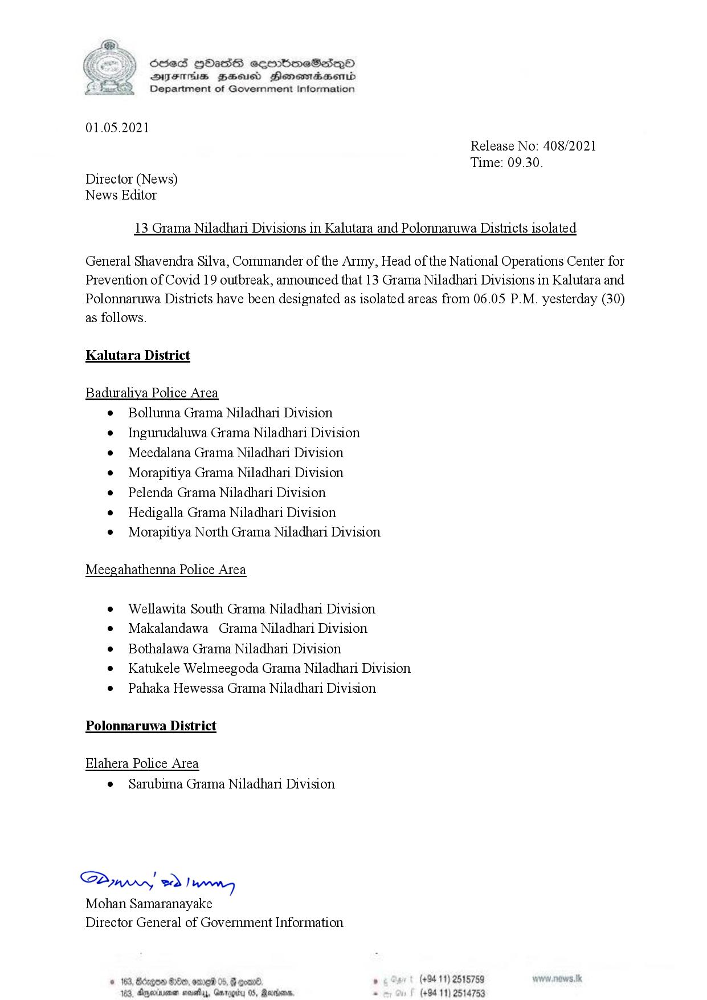

# Press Release - 2021.05.01 - 13 Grama Niladhari Divisions in Kaluthara and Polonnaruwa Districts isolated 
Key: 4a86d76176b21c43dd25c309f5e2153e 

---
```
(Ee ) Seed HOass cecembmeSiasqoO
S Y BYFThis Beeusd Heonemaasond
Department of Government Information

 

01.05.2021

Director (News)
News Editor

Release No: 408/2021
Time: 09.30.

13 Grama Niladhari Divisions in Kalutara and Polonnaruwa Districts isolated

General Shavendra Silva, Commander of the Army, Head of the National Operations Center for
Prevention of Covid 19 outbreak, announced that 13 Grama Niladhari Divisions in Kalutara and
Polonnaruwa Districts have been designated as isolated areas from 06.05 P.M. yesterday (30)

as follows.

Kalutara District

Baduraliya Police Area
¢ Bollunna Grama Niladhani Division

e Ingurudaluwa Grama Niladhari Division

e¢ Meedalana Grama Niladhari Division

e Morapitiya Grama Niladhan Division

e Pelenda Grama Niladhari Division

e Hedigalla Grama Niladhari Division

e Morapitiya North Grama Niladhari Division

Meegahathenna Police Area

¢ Wellawita South Grama Niladhari Division

e¢ Makalandawa Grama Niladhari Division

¢ Bothalawa Grama Niladhari Division

e Katukele Welmeegoda Grama Niladhari Division
e Pahaka Hewessa Grama Niladhari Division

Polonnaruwa District

Elahera Police Area
e Sarubima Grama Niladhari Division

Saw 2) wry
Mohan Samaranayake
Director General of Government Information

 

© 163, dng oDx6P 05, @ gon® .
183, merinymen sively, Garogi

 

(+94 11) 2515759
(+94 11) 2514753

```
