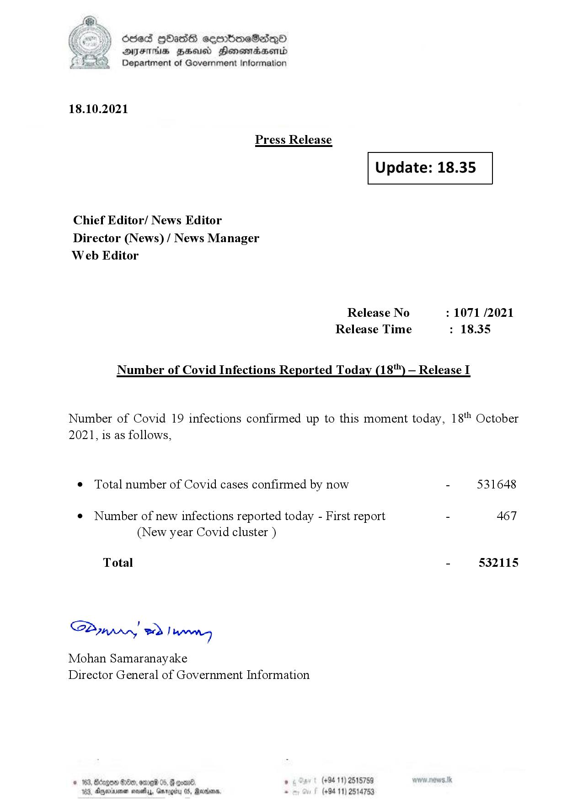

# Press Release - 2021.10.18 
Key: 4a94f4258cffd12df6775acb62383555 

---
```
(oe) Sed QOass cerrbroeSadqQo
DFS HHS Honsmnadaerntd
Department of Government Information

 

18.10.2021

Press Release

 

Update: 18.35

 

 

 

Chief Editor/ News Editor
Director (News) / News Manager
Web Editor

Release No : 1071 /2021
Release Time : 18.35

Number of Covid Infections Reported Today (18'") — Release I

Number of Covid 19 infections confirmed up to this moment today, 18" October
2021, is as follows,

¢ Total number of Covid cases confirmed by now - 531648

¢ Number of new infections reported today - First report - 467
(New year Covid cluster )

Total - 532115

SPynprn wd! wns

Mohan Samaranayake
Director General of Government Information

° (+94 11) 2515759
(+94 11) 2514753

 

```
