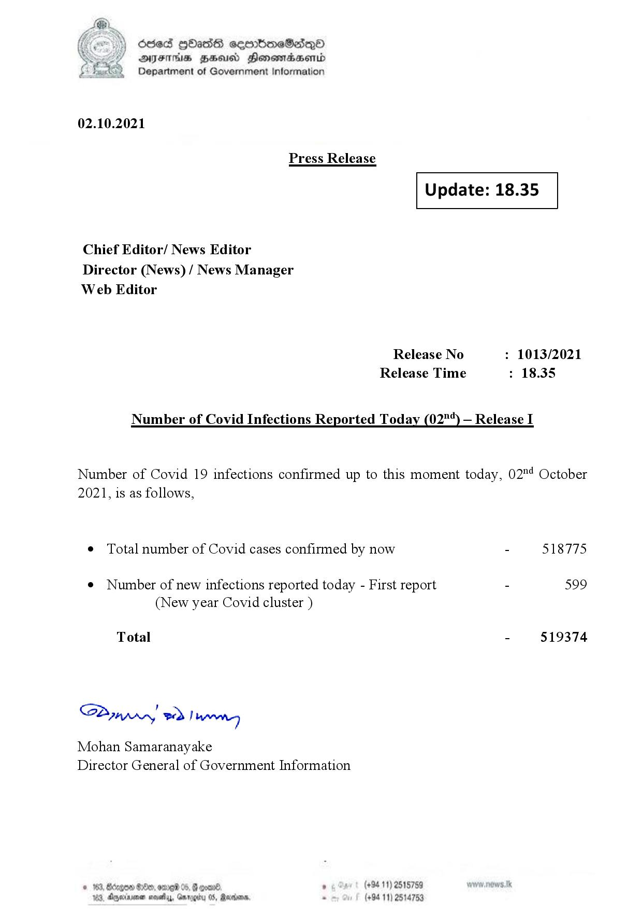

# Press Release - 2021.10 .02 
Key: 4abc953f0fea6552254ad5d79ed0adfc 

---
```
(oe) Sed QOass cerrbroeSadqQo
DFS HHS Honsmnadaerntd
Department of Government Information

 

02.10.2021

Press Release

 

Update: 18.35

 

 

 

Chief Editor/ News Editor
Director (News) / News Manager
Web Editor

Release No : 1013/2021
Release Time : 18.35

Number of Covid Infections Reported Today (02"*) — Release I

Number of Covid 19 infections confirmed up to this moment today, 02°4 October
2021, is as follows,

¢ Total number of Covid cases confirmed by now - 518775

¢ Number of new infections reported today - First report - 599
(New year Covid cluster )

Total - 519374

SPynpry wd! wang

Mohan Samaranayake
Director General of Government Information

. (+94 11) 2515759
(+94 11) 2514753

 
   

183. Agywinimen nosey, Gargitu OS,

```
