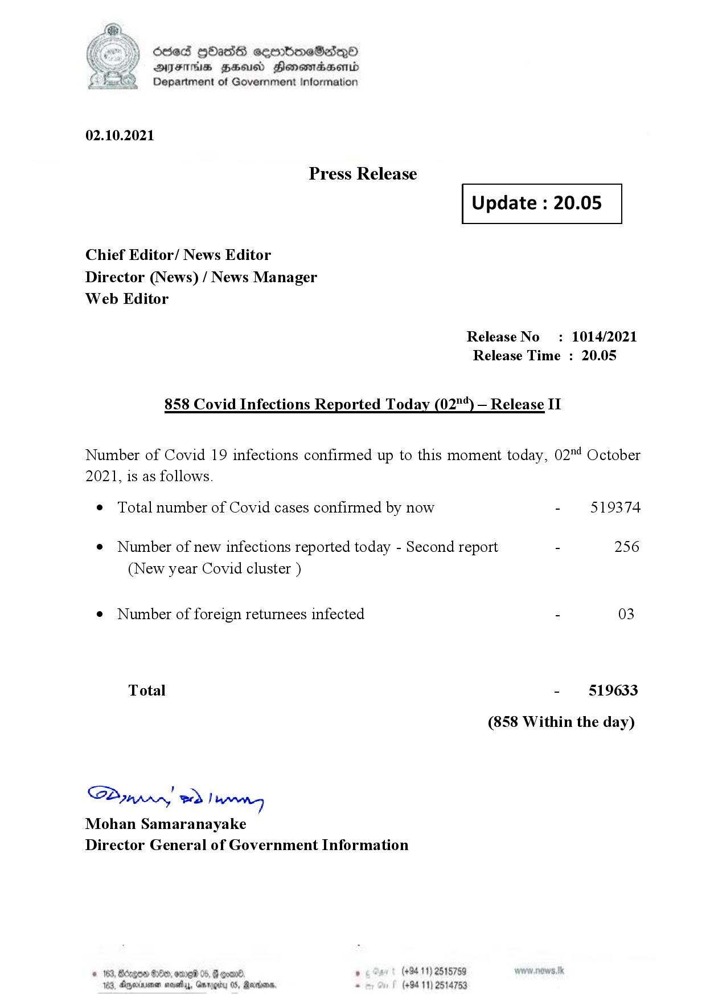

# Press Release - 2021.10.02 - Covid 19 Infection Report 
Key: 4bfe6739e573e798f61353c973b033d6 

---
```
dosed GOass eemmbmeSadepO
DFS BHU Honswnradasentd
Department of Government Information

 

 

02.10.2021

Press Release

Chief Editor/ News Editor
Director (News) / News Manager
Web Editor

 

 

Update : 20.05

 

 

Release No
Release Time :

858 Covid Infections Reported Today (02"“) — Release II

: 1014/2021
20.05

Number of Covid 19 infections confirmed up to this moment today, 02"! October

2021, is as follows.

¢ Total number of Covid cases confirmed by now

¢ Number of new infections reported today - Second report -

(New year Covid cluster )

¢ Number of foreign returnees infected

Total

SP nprrn wd Ianwng
Mohan Samaranayake
Director General of Government Information

 

. (+94 11) 2515759
(+94 11) 2514753

519374

256

03

519633

(858 Within the day)

```
