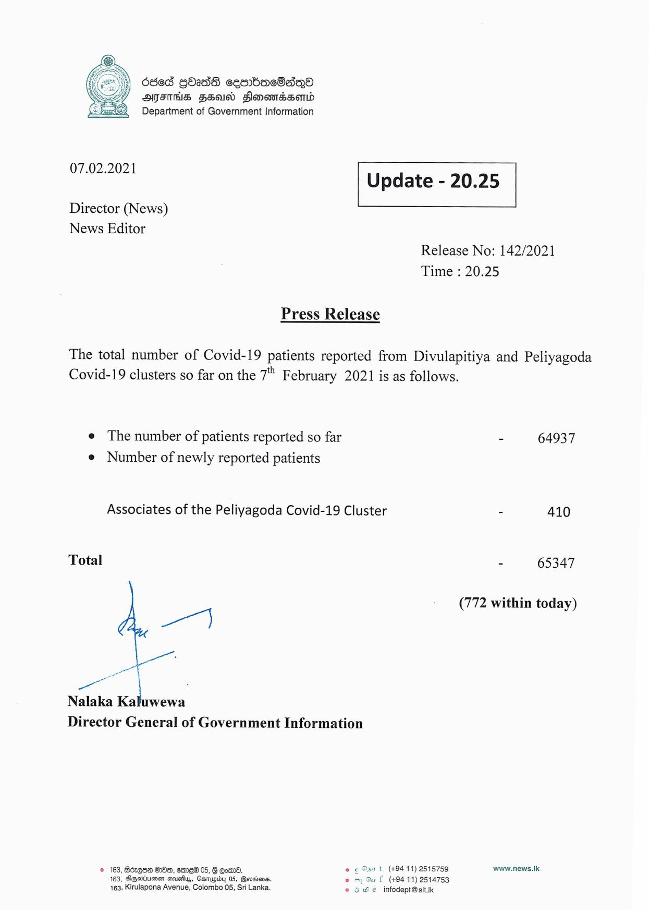

# Press Release - 2021.02.07 
Key: 4c57b7874ca37dca4eadbbfe65889bc9 

---
```
686d QbasS sembmeSanO
ATFTHS FEO Sonomdsonrd
Department of Government Information

 

 

07.02.2021 Update - 20.25

 

 

 

Director (News)

News Editor
Release No: 142/2021
Time : 20.25

Press Release
The total number of Covid-19 patients reported from Divulapitiya and Peliyagoda

Covid-19 clusters so far on the 7" February 2021 is as follows.

e The number of patients reported so far - 64937
e Number of newly reported patients

Associates of the Peliyagoda Covid-19 Cluster - 410

Total - 65347

(772 within today)

a]

a : I
Nalaka Kaluwewa
Director General of Government Information

© 163, Réxese Bo, emre® 05, § eat. © ¢ Sart (+9411) 2515759 mannii:
163, Agsiuesn sisusuy, Garapiby 05, Qevnisens. em Su f (+9411) 2514753
163, Kirulapona Avenue, Colombo 05, Sri Lanka. © oe infodept@sttik

```
