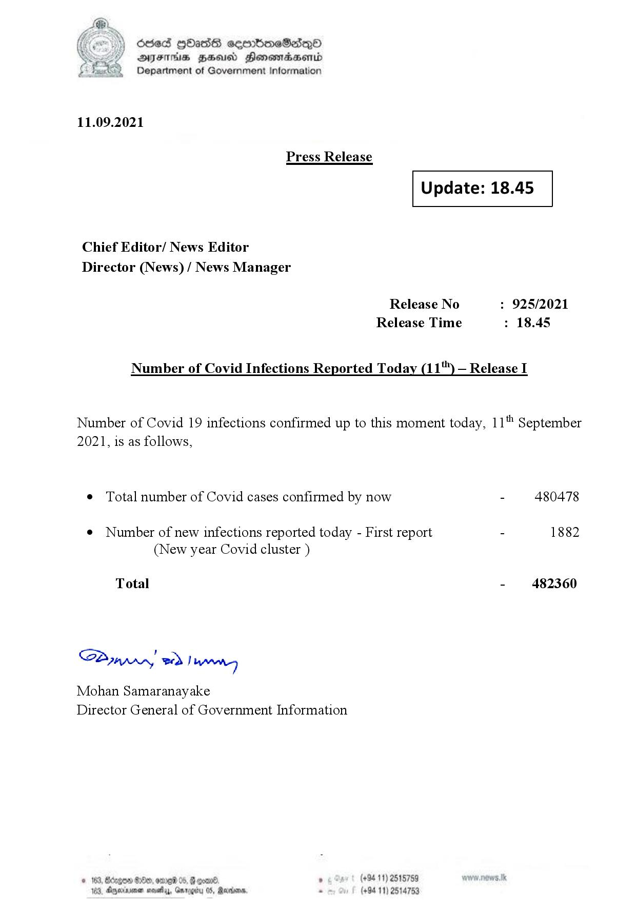

# Press Release - 2021.09.11 
Key: 4d071498034f910dddc4324de0cd3080 

---
```
(i) Oded QOass seenboeSaiQo
DFS HHS Honsmnadaerntd
Department of Government Information

 

11.09.2021

Press Release

 

Update: 18.45

 

 

 

Chief Editor/ News Editor
Director (News) / News Manager

Release No : 925/2021
Release Time : 18.45

Number of Covid Infections Reported Today (11") — Release I

Number of Covid 19 infections confirmed up to this moment today, 11" September
2021, is as follows,

¢ Total number of Covid cases confirmed by now - 480478

¢ Number of new infections reported today - First report - 1882
(New year Covid cluster )

Total - 482360

Bunn, eed | Manes

Mohan Samaranayake
Director General of Government Information

   

188, Anexivenan noes, Garogiy 05, Mardoorn,

```
