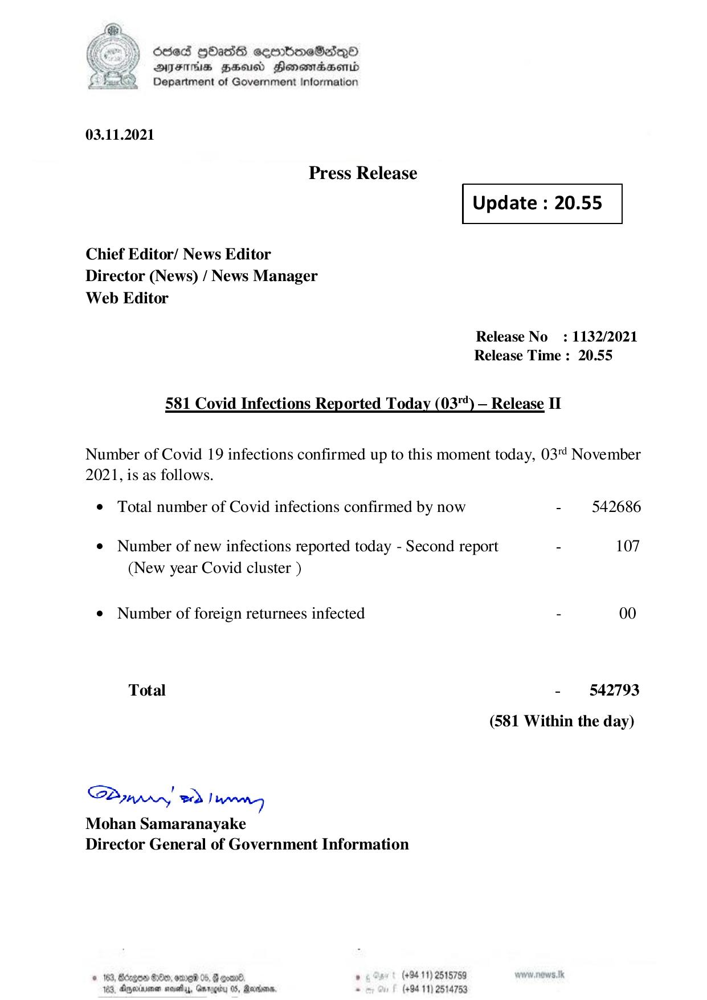

# Press Release - 2021.11.03 -Covid 19 Infection Report 
Key: 4d3f55ae80c74a0c805f8facf56806e7 

---
```
(2) sed QOadsE eeerboeB2dqQo
/ DAIFTHS HHA Henowadsentd
Department of Government Information

 

03.11.2021

Press Release

 

Update : 20.55

 

 

 

Chief Editor/ News Editor
Director (News) / News Manager
Web Editor

Release No: 1132/2021
Release Time : 20.55

581 Covid Infections Reported Today (03") — Release II

Number of Covid 19 infections confirmed up to this moment today, 03 November
2021, is as follows.

¢ Total number of Covid infections confirmed by now - 542686
¢ Number of new infections reported today - Second report - 107
(New year Covid cluster )
e¢ Number of foreign returnees infected - 00
Total - 542793
(581 Within the day)

Saar eed Joanng
Mohan Samaranayake
Director General of Government Information

© 163, Beizgoe S00, ore 05, # goane ° (#94 11) 2518789
163, Aparna seseiy, Gnrogiry 05, Ravens, - (+94 11) 2514753

```
