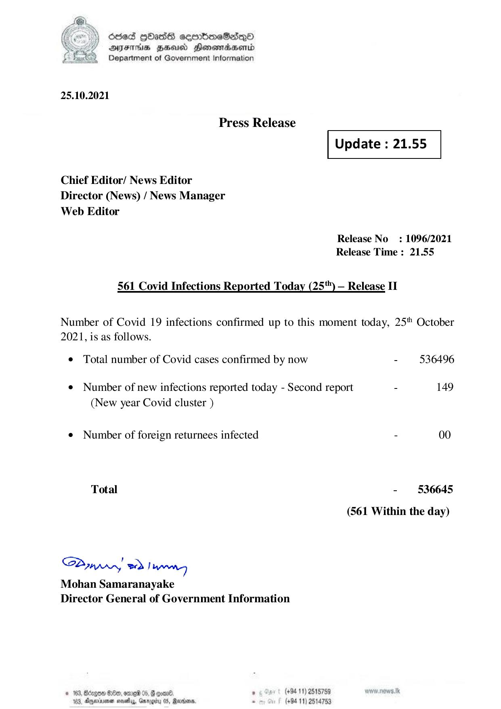

# Press Release - 2021.10.25 - Covid 19 Infection Report 
Key: 4e88a36decabe2c5cffafab218cb051d 

---
```
) died Gass ceembeSsdqQo
DFS BHU Honswnradasentd
2 Department of Government Information

   

25.10.2021

Press Release

 

Update : 21.55

 

 

 

Chief Editor/ News Editor
Director (News) / News Manager
Web Editor

Release No: 1096/2021
Release Time : 21.55

561 Covid Infections Reported Today (25") — Release II

Number of Covid 19 infections confirmed up to this moment today, 25" October
2021, is as follows.

¢ Total number of Covid cases confirmed by now - 536496
¢ Number of new infections reported today - Second report - 149
(New year Covid cluster )
e¢ Number of foreign returnees infected - 00
Total - 536645
(561 Within the day)

Saar eed Joanng
Mohan Samaranayake
Director General of Government Information

© 163, Beizgoe S00, ore 05, # goane ° (#94 11) 2518789
163, Aparna seseiy, Gnrogiry 05, Ravens, - (+94 11) 2514753

```
