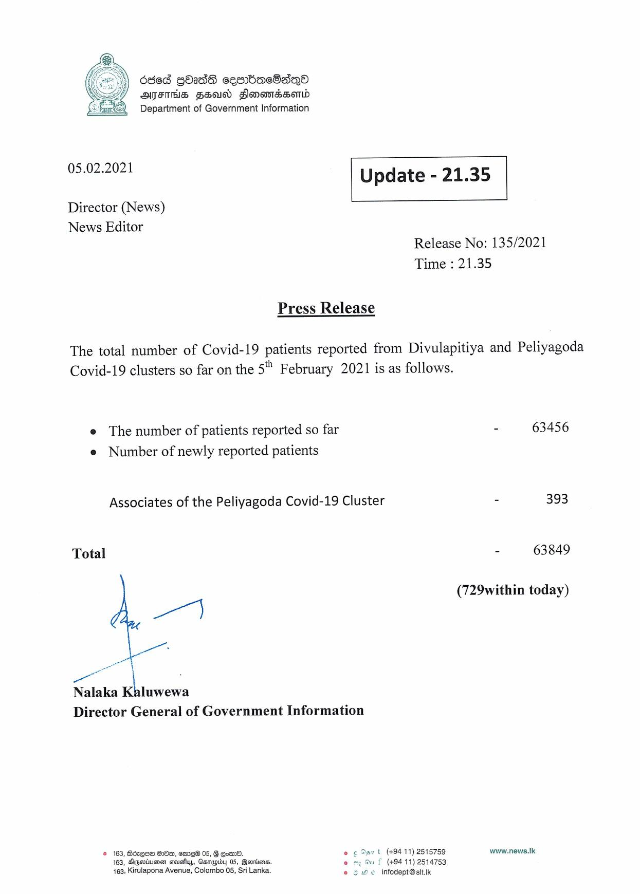

# Press Release - 2021.02.05 
Key: 4f0b2c20b2f935212ecefa1e35dac312 

---
```
dded GOadS cembae8asqo
AIFS FEUD FlomonsHomd
Department of Government Information

 

 

05.02.2021 Update - 21.35

 

 

 

Director (News)

News Editor
Release No: 135/2021

Time : 21.35

Press Release

The total number of Covid-19 patients reported from Divulapitiya and Peliyagoda
Covid-19 clusters so far on the 5" February 2021 is as follows.

e The number of patients reported so far - 63456
e Number of newly reported patients

Associates of the Peliyagoda Covid-19 Cluster 393

Total - 63849

(729within today)

wi]

Nalaka Kaluwewa
Director General of Government Information

© 163, Bdcque QO, mew 05, G Com. © ¢ Dart (+9411) 2515759 www.news.Ik
163, SiGwLLIAE crass, Asrepiey 05, Bevrions. om Su f (494 11) 2514753
4163, Kirulapona Avenue, Colombo 05, Sri Lanka. © 6 We infodept@sit.k

```
