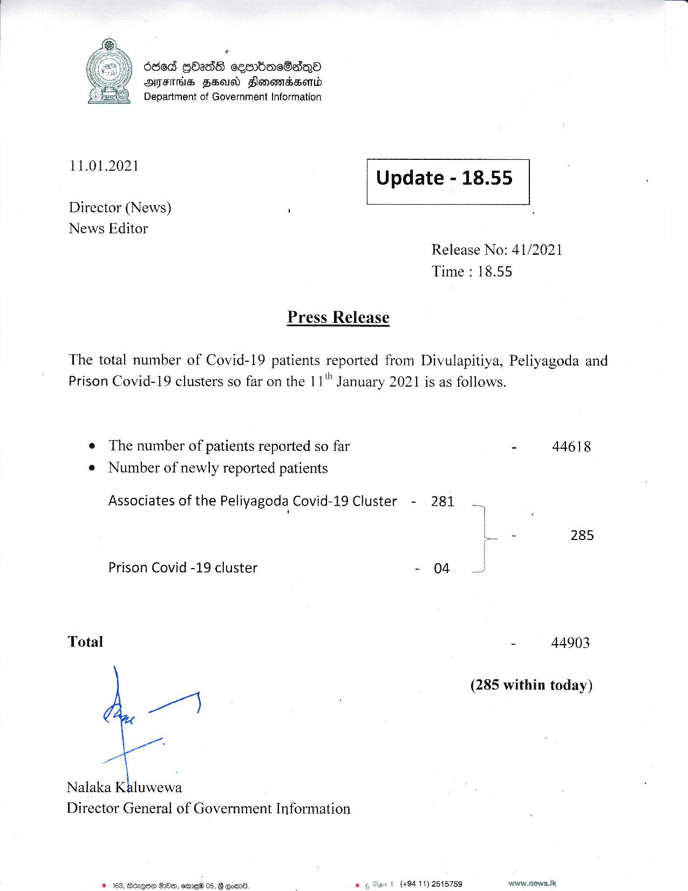

# Press Release - 2021.01.11 
Key: 50795291d1abd6a5beaf73ed86aaba3d 

---
```
6865 GOadS cesrbmcOadQoa
ATES FSO) SlonowrSBonld
Department of Government Information

}

 

 

11.01.2021 Update - 18.55

Director (News) \
News Editor

 

 

 

Release No: 41/2021
Time : 18.55

Press Release

The total number of Covid-19 patients reported from Divulapitiya, Peliyagoda and
Prison Covid-19 clusters so far on the 11" January 2021 is as follows.

e The number of patients reported so far - 44618
e Number of newly reported patients

Associates of the Peliyagoda Covid-19 Cluster - 281 ...

hw & 285

Prison Covid -19 cluster - 04

Total - 44903

(285 within today)

 

Nalaka Kaluwewa
Director General of Government Information

t (+94 11) 2515759 www.news.Ik.

 

DOO, eme® 05, B Com.

 

```
