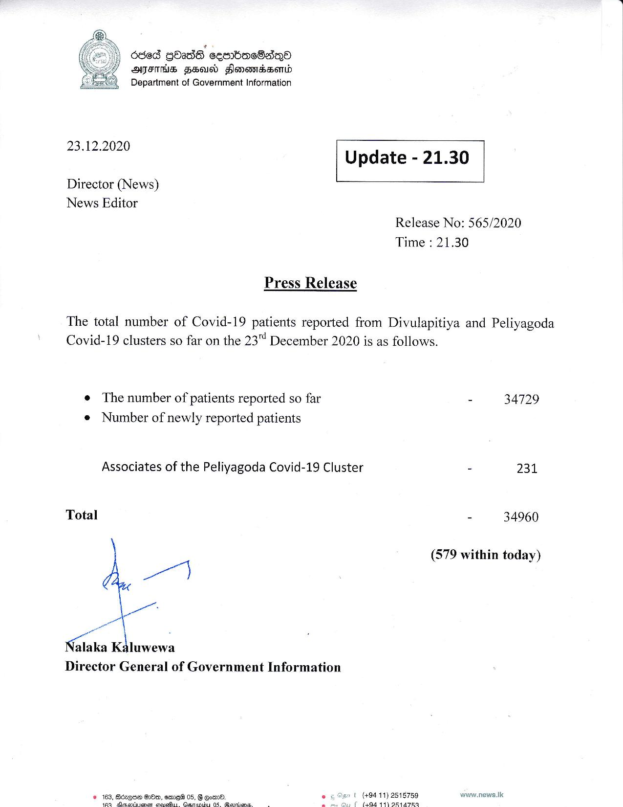

# Press Release - 2020.12.23 
Key: 50f9cd58796549f28abdbbb3c03d8527 

---
```
  

| d8ed gdadh cembaeSaQo
AFIS HED Honewidsemd
Department of Government Information

 

23.12.2020

 

Update - 21.30

 

 

Director (News)
News Editor

Release No: 565/2020
Time : 21.30

Press Release

The total number of Covid-19 patients reported from Divulapitiya and Peliyagoda
Covid-19 clusters so far on the 23% December 2020 is as follows.

e The number of patients reported so far
« Number of newly reported patients

Associates of the Peliyagoda Covid-19 Cluster

Total
rE
Nalaka Kdluwewa

Director General of Government Information

© 183, Bdzene G1Om, emes 05, B Eom, ° 5! (+94 11) 2515759
WHER itcastiaaiie casas faarmic: Ge mie: 5 es ioe 44 aRaTR:

- 34729

e 231

- 34960

(579 within today)

waww.news.tk

```
