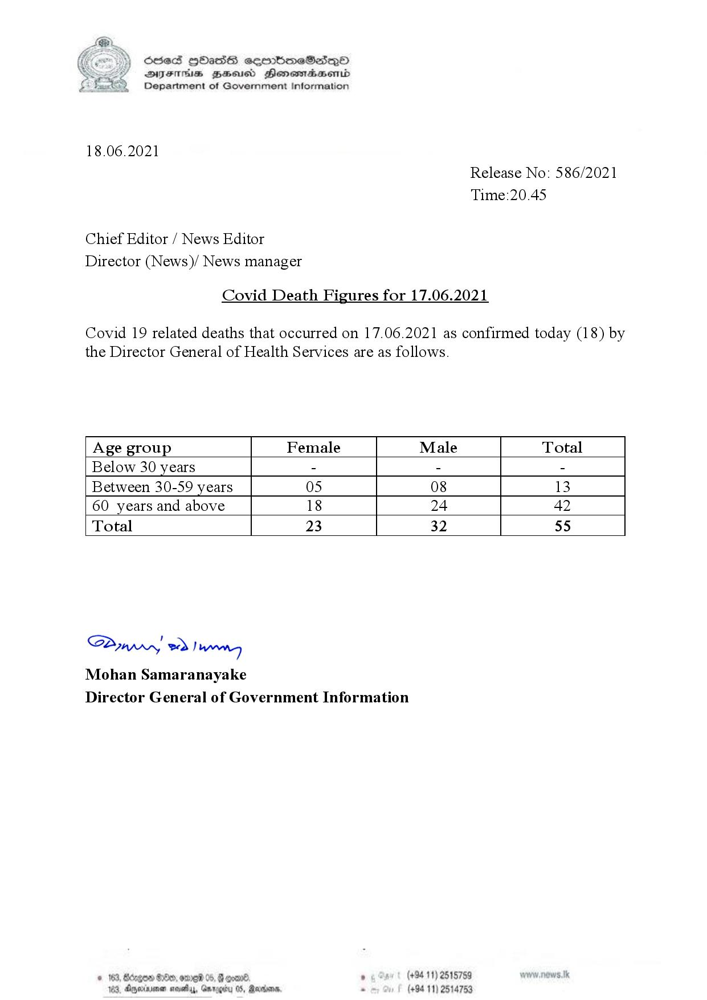

# Press Release - 2021.06.18 - Covid 19 infection deaths 
Key: 5106fa8c95b46938579af2442d43f487 

---
```
(6 S) ScseS HOasdS cerrbmeSdQo
DFTs BHEosd Henewtaeasernid
Department of Government Information

 

18.06.2021

Chief Editor / News Editor
Director (News)/ News manager

Covid Death Figures for 17.06.2021

Release No: 586/2021
Time:20.45

Covid 19 related deaths that occurred on 17.06.2021 as confirmed today (18) by

the Director General of Health Services are as follows.

 

 

 

 

 

 

 

 

 

 

Age group Female Male Total
Below 30 years - - -
Between 30-59 years 05 08 13
60 years and above 18 24 42
Total 23 32 55

 

Saw o> Danny
Mohan Samaranayake
Director General of Government Information

70) OLD, om 06, ,

Aparna nosey, Oar

   

 

```
