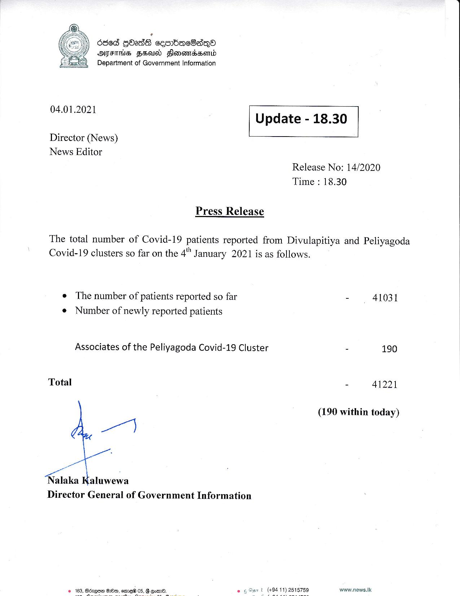

# Press Release - 2021.01.04 
Key: 51aa4cfcf9cb4c6a3b92c9b7f27ccc44 

---
```
636d GOs cesrbacOsq®
AFIS FEU Slonomasasend
Department of Government Information

 

 

04.01.2021 Update - 18.30

 

 

 

Director (News)

News Editor
Release No: 14/2020
Time : 18.30

Press Release

The total number of Covid-19 patients reported from Divulapitiya and Peliyagoda
Covid-19 clusters so far on the 4" J anuary 2021 is as follows.

e The number of patients reported so far - 41031
¢ Number of newly reported patients

Associates of the Peliyagoda Covid-19 Cluster - 190

Total 41221

(190 within today)

I

a

—

Nalaka Kaluwewa
Director General of Government Information

© 163, Bdzqae BHm, ame® 05, G eon. www.news.Ik

  

 

```
