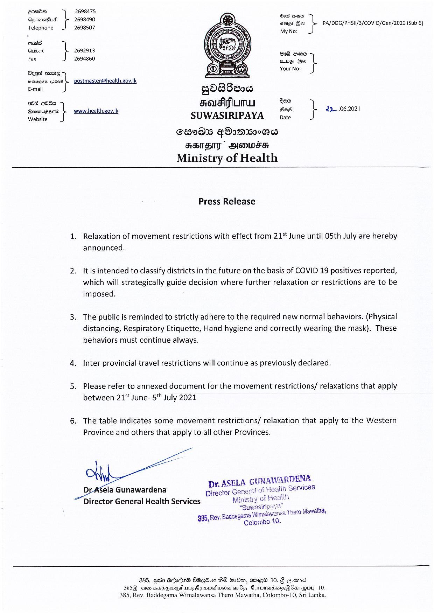

# Press Release - 2021.06.22 - Press release on Relaxations of restrictions with effect of 21st of June 
Key: 51dcd1d358f5e22535b8cbd81c79b7d9 

---
```
2698475

 

gomde =,
ines
pe arern io ais Boo PA/DDG/PHSII/3/COVID/Gen/2020 (Sub 6)
Telephone 2698507 My No:
enced
Guaort 2692913 G08 ces
Fax 2694860 ides mes }
Ye No:
Benes mere GUENO:
Wiacudes wynan L postmaster@health.gov.lk
E-mail gdBSe008
e288 aes FOUFPLITU a teres
Feorsoawis sent www. health.gov.lk 1! 06.202
Website SUWASIRIPAYA Date

S9DS FOomMIS OS
ABTBIT  DOOWFH
Ministry of Health

 

Press Release

Relaxation of movement restrictions with effect from 21° June until O5th July are hereby
announced.

It is intended to classify districts in the future on the basis of COVID 19 positives reported,
which will strategically guide decision where further relaxation or restrictions are to be
imposed.

The public is reminded to strictly adhere to the required new normal behaviors. (Physical
distancing, Respiratory Etiquette, Hand hygiene and correctly wearing the mask). These
behaviors must continue always.

Inter provincial travel restrictions will continue as previously declared.

Please refer to annexed document for the movement restrictions/ relaxations that apply
between 21% June- 5" July 2021

The table indicates some movement restrictions/ relaxation that apply to the Western
Province and others that apply to all other Provinces.

 
    

Sela Gunawardena
Director General Health Services

 

Director

 

 Baddegama Wi
385, Rev. Col

 

 

385, eis Aded@® SOEHom BS QoDm, emE® 10. § @emmd
3859, asms55nSGRULSCZSvoonaMmsCs CorrmdmsQCsrapoy 10.
385, Rev. Baddegama Wimalawansa Thero Mawatha, Colombo-10, Sri Lanka.

```
