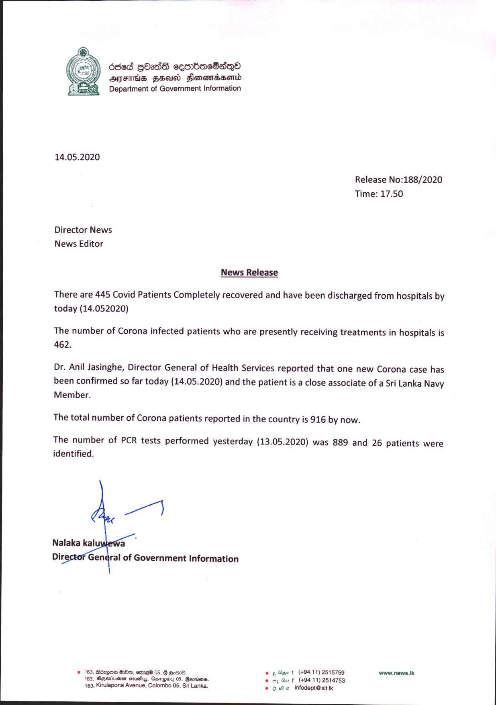

# Press Release - 2020.05.14 - Total number of Corona patients reported in the country is 916 by now 
Key: 5242ec7c2a7bfd04bbafcefce8c2a7d3 

---
```
   
  
    
   
  
   
  
   
  
  

ded gO238 seaboeSsdQ®
AJITHS FSU Slonomdssemd
Department of Government Information

14.05.2020

Release No:188/2020
Time: 17.50

Director News
News Editor

News Release

There are 445 Covid Patients Completely recovered and have been discharged from hospitals by
today (14.052020)

The number of Corona infected patients who are presently receiving treatments in hospitals is
462.

Dr. Anil Jasinghe, Director General of Health Services reported that one new Corona case has
been confirmed so far today (14.05.2020) and the patient is a close associate of a Sri Lanka Navy
Member.

The total number of Corona patients reported in the country is 916 by now.

The number of PCR tests performed yesterday (13.05.2020) was 889 and 26 patients were
identified.

 

© 163, Bozqce 8x, ero 05, oon», @ ¢ Ser t (+9411) 2518759 www.news.k
163, Agedineen arevstiys, Gsnapr 05, Geordies. © oy Gu f (+9411) 2514753
163. Kirulapona Avenue, Colombo 05, Sri Lanka. © 0. e infodept@ stt ik

 

 

```
