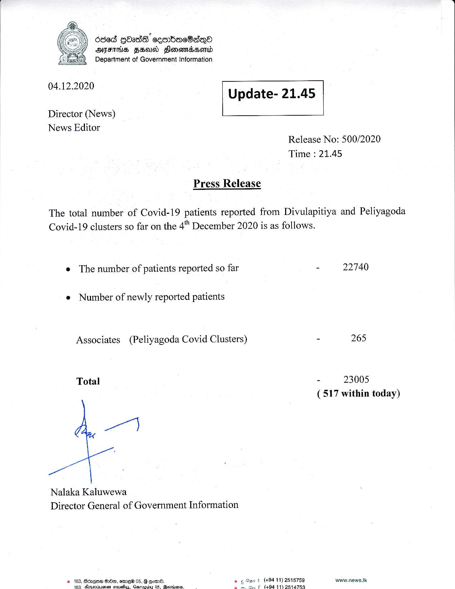

# Press Release - 2020.12.04 
Key: 539bcdb4d83059f4363f2514c665544f 

---
```
  
 

) 6868 GOasE ceerbeoeBa®
AIS FS Flonomssomwd
Department of Government Information

 

04.12.2020
Update- 21.45

 

 

Director (News)
News Editor

 

Release No: 500/2020
Time : 21.45

Press Release

The total number of Covid-19 patients reported from Divulapitiya and Peliyagoda
Covid-19 clusters so far on the 4"" December 2020 is as follows.

e The number of patients reported so far - 22740

e Number of newly reported patients

Associates (Peliyagoda Covid Clusters) - 265
Total - 23005
(517 within today)

a)

ge i
Nalaka Kaluwewa
Director General of Government Information

© 163, Bcrgse OOo, eme® 05, G Goin.
183 Binsotueset eelelus. Qernowu 05. Menieos.

+ (49411) 2518759 www.news.Ik
¢ (404 11) 251747469

 

 

```
