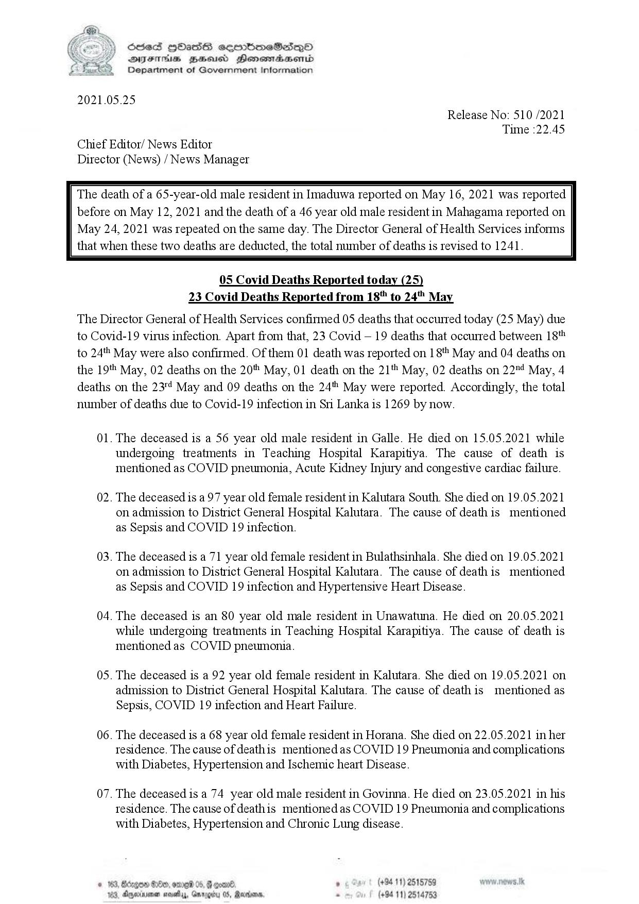

# Press Release - 2021.05.25 -Covid 19 infection deaths 
Key: 53d90b1d47d37ecea237cafd7097aa6e 

---
```
SeS HOHasS sermimeSes—poO
SYEThis ZHsusd Henomadsemd
Department of Government Information

 

2021.05.25
Release No: 510 /2021
Time :22.45
Chief Editor/ News Editor
Director (News) / News Manager

The death of a 65-year-old male resident in Imaduwa reported on May 16, 2021 was reported
before on May 12, 2021 and the death of a 46 year old male resident in Mahagama reported on

May 24, 2021 was repeated on the same day. The Director General of Health Services informs
that when these two deaths are deducted, the total number of deaths is revised to 1241.

 

05 Covid Deaths Reported today (25)
23 Covid Deaths Reported from 18" to 24 May

The Director General of Health Services confirmed 05 deaths that occurred today (25 May) due
to Covid-19 virus infection. Apart from that, 23 Covid — 19 deaths that occurred between 18"
to 24th May were also confirmed. Of them 01 death was reported on 1 8t* May and 04 deaths on
the 19t* May, 02 deaths on the 20" May, 01 death on the 21t May, 02 deaths on 22" May, 4
deaths on the 23" May and 09 deaths on the 24" May were reported. Accordingly, the total
number of deaths due to Covid-19 infection in Si Lanka is 1269 by now.

01. The deceased is a 56 year old male resident in Galle. He died on 15.05.2021 while
undergoing treatments in Teaching Hospital Karapitiya. The cause of death is
mentioned as COVID pneumonia, Acute Kidney Injury and congestive cardiac failure.

02. The deceased is a 97 year old female resident in Kalutara South. She died on 19.05.2021
on admission to District General Hospital Kalutara. The cause of death is mentioned
as Sepsis and COVID 19 infection.

03. The deceased is a 71 year old female resident in Bulathsinhala. She died on 19.05.2021
on admission to District General Hospital Kalutara. The cause of death is mentioned
as Sepsis and COVID 19 infection and Hypertensive Heart Disease.

04. The deceased is an 80 year old male resident in Unawatuna. He died on 20.05.2021
while undergoing treatments in Teaching Hospital Karapitiya. The cause of death is
mentioned as COVID pneumonia.

05. The deceased is a 92 year old female resident in Kalutara. She died on 19.05.2021 on
admission to District General Hospital Kalutara. The cause of death is mentioned as
Sepsis, COVID 19 infection and Heart Failure.

06. The deceased is a 68 year old female resident in Horana. She died on 22.05.2021 in her
tesidence. The cause of deathis mentioned as COVID 19 Pneumonia and complications
with Diabetes, Hypertension and Ischemic heart Disease.

07. The deceased is a 74 year old male resident in Govinna. He died on 23.05.2021 in his
tesidence. The cause of deathis mentioned as COVID 19 Pneumonia and complications
with Diabetes, Hypertension and Chronic Lung disease.

, (+94 11) 2515759
(+94 11) 2514753

 

```
