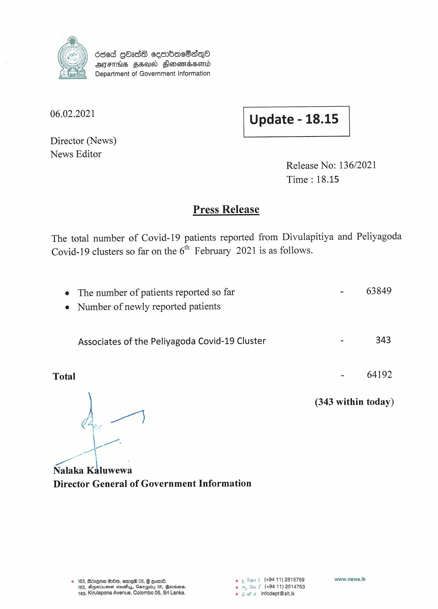

# Press Release - 2021.02.06 
Key: 557494f15bfbf9d27951c0053af977e9 

---
```
686d GOAdE ceesmBdeaeSaiqQo
AFTHS FSAI Sonamedserd
Department of Government Information

 

 

06.02.2021

 

Update - 18.15

 

 

Director (News)
News Editor

Release No: 136/2021
Time : 18.15

Press Release

The total number of Covid-19 patients reported from Divulapitiya and Peliyagoda
Covid-19 clusters so far on the 6" February 2021 is as follows.

e The number of patients reported so far
e Number of newly reported patients

Associates of the Peliyagoda Covid-19 Cluster

Total

le
Nalaka a Kbtuwewa
Director General of Government Information

© 163, Bdzgoe G80, em 05, 8 Go. og. @ant (10411) 2616768
163, AGtueen sieusfiy, arapiby 0S, Bernina, ee my Gu f (494 11) 2514753
163, Kirulapona Avenue, Colombo 05, Sri Lanka. © 5 He infodept@sit.ik

  

- 63849

- 343

64192

(343 within today)

www.news.Ik

```
