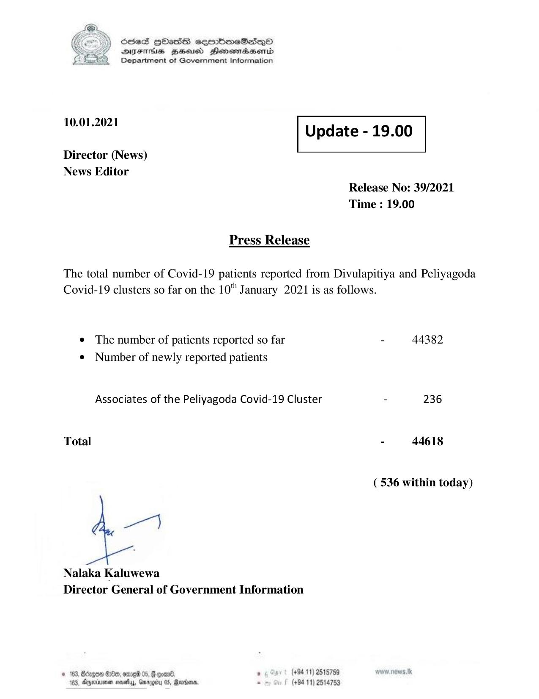

# Press Release - 2021.01.10 
Key: 563d75dad10a21d73f5529c767767fc6 

---
```
S) OSes HOHasis sombmeSad—yQO
DIFIHS BHEoisd Heonestaasenid
Department of Government Information

 

 

 

 

 

10.01.2021
Update - 19.00
Director (News)
News Editor
Release No: 39/2021

Time : 19.00

Press Release

The total number of Covid-19 patients reported from Divulapitiya and Peliyagoda
Covid-19 clusters so far on the 10" January 2021 is as follows.

e The number of patients reported so far - 44382
¢ Number of newly reported patients

Associates of the Peliyagoda Covid-19 Cluster - 236
Total - 44618

( 536 within today)

ye)

Nalaka Kaluwewa
Director General of Government Information

© 163, Borgen GOe, ome 05, § goad , (+94 11) 2515759
103, Dnexenan neatly, Garooity 05, Review, . (+94 11) 2514753

```
