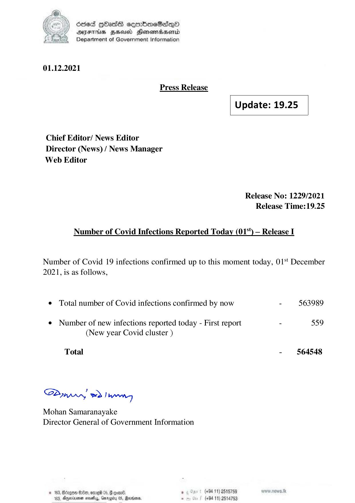

# Press Release - 2021.12.01 
Key: 56d481f94c963851af9bb824be382e67 

---
```
) dcded QhasS ceerbneSdiqQo
DFTs HH Honsomadsenid
Department of Government Information

 

 

01.12.2021
Press Release
Update: 19.25
Chief Editor/ News Editor
Director (News) / News Manager
Web Editor

Release No: 1229/2021
Release Time:19.25

Number of Covid Infections Reported Today (01°) — Release I

Number of Covid 19 infections confirmed up to this moment today, 01‘ December
2021, is as follows,

© Total number of Covid infections confirmed by now - 563989

¢ Number of new infections reported today - First report - 559
(New year Covid cluster )

Total - 564548

Sa mprr wd! bong

Mohan Samaranayake
Director General of Government Information

 

© 163, Bdzgoe $10, ome 05, @ gomn® ’ (+94 11) 2615759

163, Apexnener sevethys, Garogiry 0S, Rare, - (+94 11) 2514753

```
