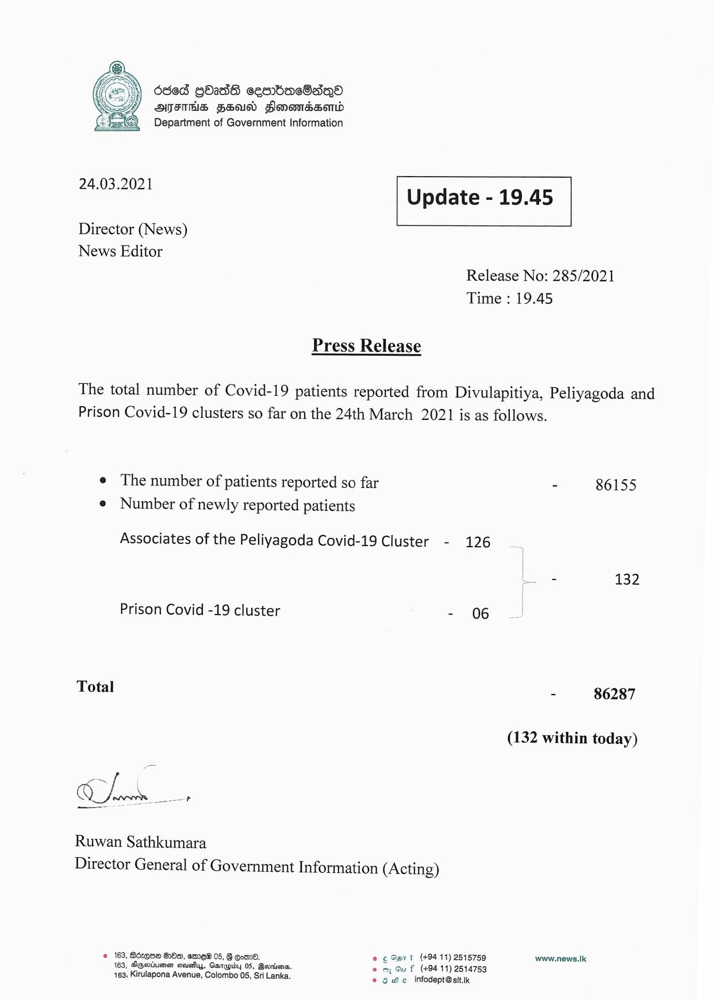

# Press Release - 2021.03.24 
Key: 57344b0ae3b3fc7208e6ce6a604d8178 

---
```
686d QOas sesrbacSadqea
AFIS FSU Flonomaesontd
Department of Government Information

 

 

24.03.2021 Update - 19.45

 

 

 

Director (News)

News Editor
Release No: 285/2021
Time : 19.45

Press Release

The total number of Covid-19 patients reported from Divulapitiya, Peliyagoda and
Prison Covid-19 clusters so far on the 24th March 2021 is as follows.

e The number of patients reported so far - 86155
e Number of newly reported patients

Associates of the Peliyagoda Covid-19 Cluster - 126
- 132

Prison Covid -19 cluster - 06

Total - 86287

(132 within today)

Ruwan Sathkumara
Director General of Government Information (Acting)

© 163, Bdzese QOe, emE@ 05, 8 om. e 6 O57 t (+94 11) 2515759 www.news.Ik
163, Ageriuenen seuss, Garagidy 05, Beoriens. © my Gu f (+9411) 2514753
163, Kirulapona Avenue, Colombo 05, Sri Lanka. © 3 we infodept@stt.k

```
