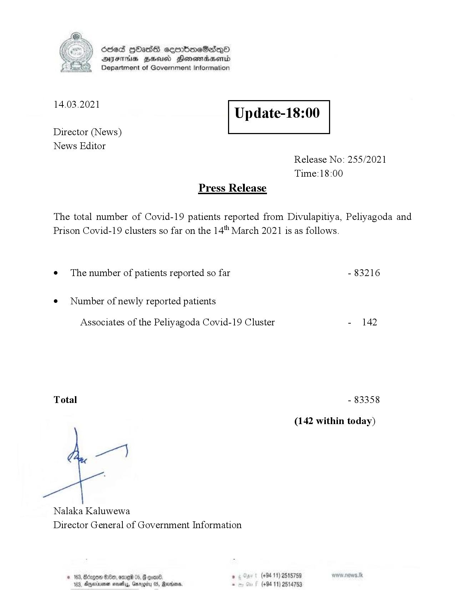

# Press Release - 2021.03.14 
Key: 57de91ebdb553e5285e5e69393e0e5c1 

---
```
Ssed HbasG sembmeSadqo
DAIS BHU Honomasentd
Department of Government Information

 

 

14.03.2021

Update-18:00

 

 

 

Director (News)
News Editor
Release No: 255/2021
Time:18:00
Press Release

The total number of Covid-19 patients reported from Divulapitiya, Peliyagoda and
Prison Covid-19 clusters so far on the 14" March 2021 is as follows.
e¢ The number of patients reported so far - 83216

¢ Number of newly reported patients

Associates of the Peliyagoda Covid-19 Cluster - 142

Total - 83358

(142 within today)

ee)

Nalaka Kaluwewa
Director General of Government Information

© 163, Bzgow #180, ome 05, G coal , (+94 11) 2515759
183, Aqexrrsna sesety, Gnrogiru 05, Rares - (+94 11) 2514753

```
