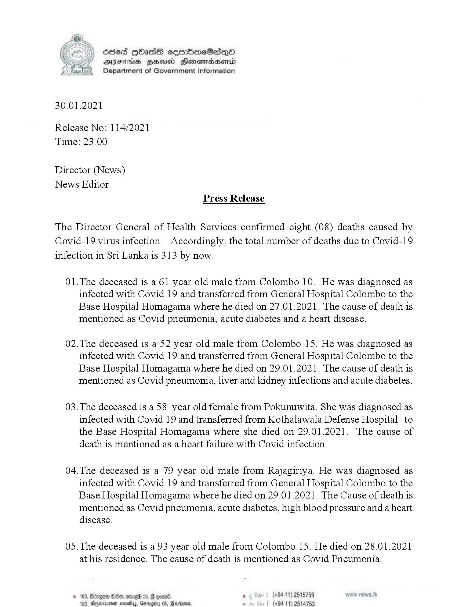

# Press Release - 2021.01.30 - Covid 19 infection deaths 
Key: 59046546d804c041896e64910a72f6fc 

---
```
osed HOHass seembmeSadq0
AIFS HHA Honowmradserid
Department of Government Information

 

 

30.01.2021

Release No: 114/2021
Time: 23.00

Director (News)
News Editor
Press Release

The Director General of Health Services confirmed eight (08) deaths caused by
Covid-19 virus infection. Accordingly, the total number of deaths due to Covid-19
infection in Sri Lanka is 313 by now.

01.The deceased is a 61 year old male from Colombo 10. He was diagnosed as
infected with Covid 19 and transferred from General Hospital Colombo to the
Base Hospital Homagama where he died on 27.01.2021. The cause of death is
mentioned as Covid pneumonia, acute diabetes and a heart disease.

02.The deceased is a 52 year old male from Colombo 15. He was diagnosed as
infected with Covid 19 and transferred from General Hospital Colombo to the
Base Hospital Homagama where he died on 29.01.2021. The cause of death is
mentioned as Covid pneumonia, liver and kidney infections and acute diabetes.

03.The deceased is a 58 year old female from Pokunuwita. She was diagnosed as
infected with Covid 19 and transferred from Kothalawala Defense Hospital to
the Base Hospital Homagama where she died on 29.01.2021. The cause of
death is mentioned as a heart failure with Covid infection.

04.The deceased is a 79 year old male from Rajagiriya. He was diagnosed as
infected with Covid 19 and transferred from General Hospital Colombo to the
Base Hospital Homagama where he died on 29.01.2021. The Cause of death is
mentioned as Covid pneumonia, acute diabetes, high blood pressure and a heart
disease.

05.The deceased is a 93 year old male from Colombo 15. He died on 28.01.2021
at his residence. The cause of death is mentioned as Covid Pneumonia.

. (+94 11) 2515789
(494 11) 2514753

 

```
