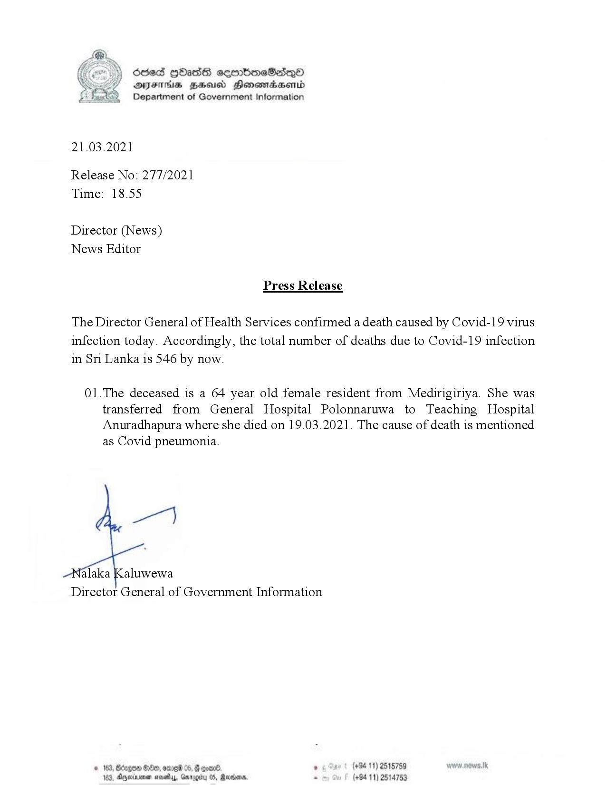

# Press Release - 2021.03.21 - Covid 19 infection deaths 
Key: 597f3feb12dee42b49fd7c3c8bb085e0 

---
```
Sded HOsassG sembomeSadqO
AIFS BHU Honsmasentd
Department of Government Information

 

21.03.2021

Release No: 277/2021
Time: 18.55

Director (News)
News Editor

Press Release

The Director General of Health Services confirmed a death caused by Covid-19 virus
infection today. Accordingly, the total number of deaths due to Covid-19 infection
in Sri Lanka is 546 by now.

01.The deceased is a 64 year old female resident from Medirigiriya. She was
transferred from General Hospital Polonnaruwa to Teaching Hospital
Anuradhapura where she died on 19.03.2021. The cause of death is mentioned
as Covid pneumonia.

pe)

alaka Kaluwewa
Director General of Government Information

© 163, Borgen 800, ome 05, @ eoar® . (+94 11) 2515789
103, Oyminvenen novels, Garogity 05, Rando. . (+94 11) 2514753

```
