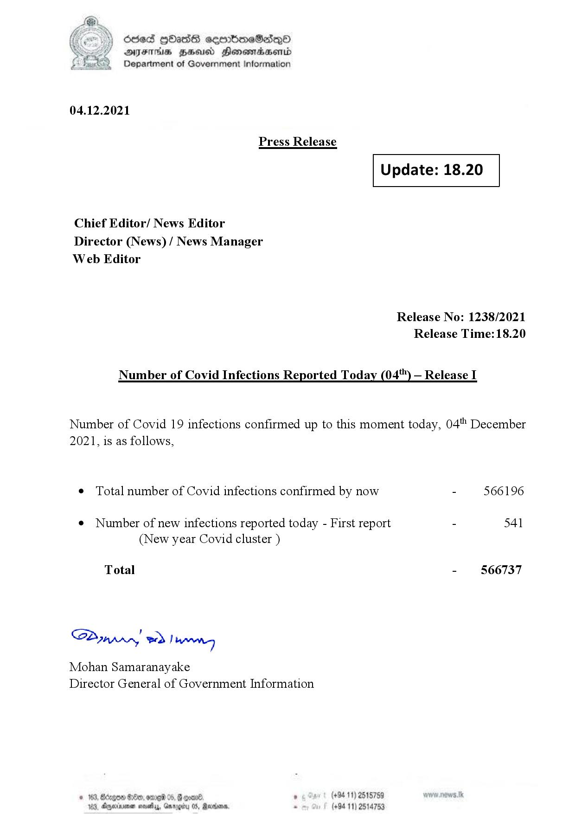

# Press Release - 2021.12.04 
Key: 59b347c8f8ec51e482f0dd311b3ccb46 

---
```
(oe) Sed QOass cerrbroeSadqQo
DFS HHS Honsmnadaerntd
Department of Government Information

 

04.12.2021

Press Release

 

Update: 18.20

 

 

 

Chief Editor/ News Editor
Director (News) / News Manager
Web Editor

Release No: 1238/2021
Release Time: 18.20

Number of Covid Infections Reported Today (04'") — Release I

Number of Covid 19 infections confirmed up to this moment today, 04'" December
2021, is as follows,

¢ Total number of Covid infections confirmed by now - 566196

¢ Number of new infections reported today - First report - 541
(New year Covid cluster )

Total - 566737

Sa mprn! wd! wong

Mohan Samaranayake
Director General of Government Information

oom08) , (+9411) 2515759
05, Rerins. - (+84 11) 25

 
 

© 163, Bdrgon Ge, ome 05, F
163, Aparna sosehyy, Gnr

  

```
