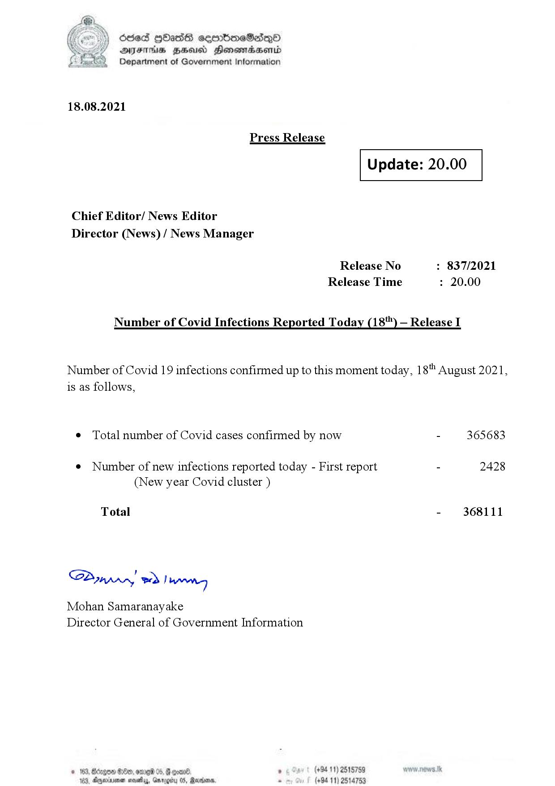

# Press Release - 2021.08.18 
Key: 59f61b7b706222284ba1567a2087d572 

---
```
(2) Oded QOasS cseenboeSiqQo
DFS HHS Honsmnadaerntd
Department of Government Information

 

18.08.2021

Press Release

 

Update: 20.00

 

 

 

Chief Editor/ News Editor
Director (News) / News Manager

Release No : 837/2021
Release Time : 20.00

Number of Covid Infections Reported Today (18) — Release I

Number of Covid 19 infections confirmed up to this moment today, 18" August 2021,
is as follows,

¢ Total number of Covid cases confirmed by now - 365683

¢ Number of new infections reported today - First report - 2428
(New year Covid cluster )

Total - 368111

Sa nprrn! wd! wong

Mohan Samaranayake
Director General of Government Information

© . (+94 11) 2515759
163, Aneinener sosethy, Garogity 05, Ravens, . (+94 11) 2!

 

 

```
