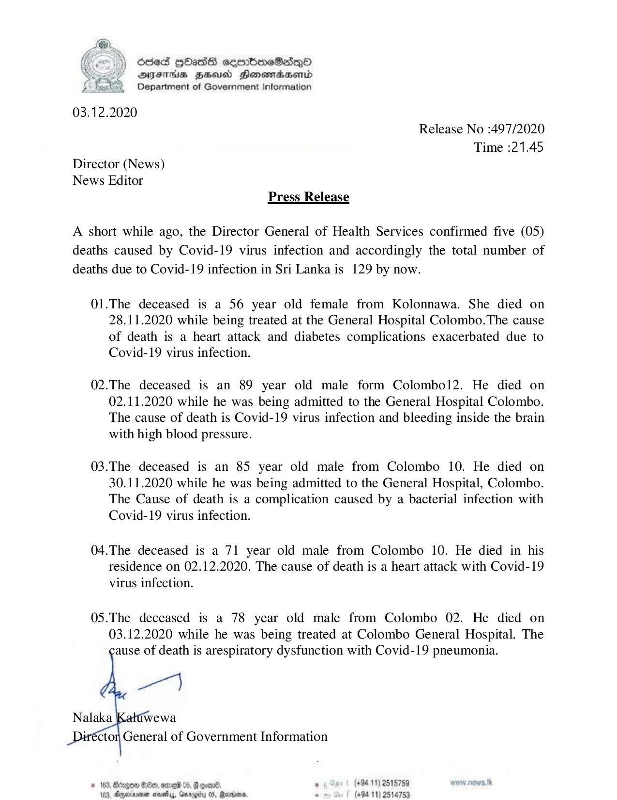

# Press Release - 2020.12.03 - Covid 19 infection deaths rises to 129 
Key: 5a281a09c3938c5641f9178d41edd17f 

---
```
) ScseS GOasS ceerbroeSdqQo
AIFS HSU Honomadsenid
Department of Government Information

 

03.12.2020
Release No :497/2020
Time :21.45
Director (News)
News Editor
Press Release

A short while ago, the Director General of Health Services confirmed five (05)
deaths caused by Covid-19 virus infection and accordingly the total number of
deaths due to Covid-19 infection in Sri Lanka is 129 by now.

01.The deceased is a 56 year old female from Kolonnawa. She died on
28.11.2020 while being treated at the General Hospital Colombo.The cause
of death is a heart attack and diabetes complications exacerbated due to
Covid-19 virus infection.

02.The deceased is an 89 year old male form Colombol2. He died on
02.11.2020 while he was being admitted to the General Hospital Colombo.
The cause of death is Covid-19 virus infection and bleeding inside the brain
with high blood pressure.

03.The deceased is an 85 year old male from Colombo 10. He died on
30.11.2020 while he was being admitted to the General Hospital, Colombo.
The Cause of death is a complication caused by a bacterial infection with
Covid-19 virus infection.

04.The deceased is a 71 year old male from Colombo 10. He died in his
residence on 02.12.2020. The cause of death is a heart attack with Covid-19
virus infection.

05.The deceased is a 78 year old male from Colombo 02. He died on
03.12.2020 while he was being treated at Colombo General Hospital. The
ause of death is arespiratory dysfunction with Covid-19 pneumonia.

  
   

ctor General of Government Information

* 183, Barges Hie, ome %, Good . (+8411) 2515759
Anywrinvner novels, Gurogiby 0S, Reonbare, “ (+9411) 2534753

 

```
