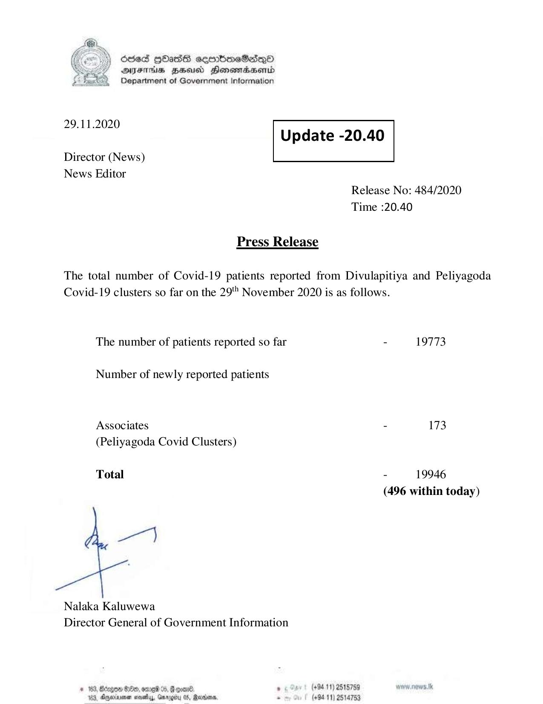

# Press Release - 2020.11.29 
Key: 5ab08cd5b36fff3cf44372d41528cc3c 

---
```
6563 HOHasG sembmcSasqQo
DAJFITAs BHU Honomrdbsertd
Department of Government Information

 

 

29.11.2020
Update -20.40

 

 

Director (News)
News Editor

 

Release No: 484/2020
Time :20.40

Press Release
The total number of Covid-19 patients reported from Divulapitiya and Peliyagoda
Covid-19 clusters so far on the 29" November 2020 is as follows.
The number of patients reported so far - 19773
Number of newly reported patients
Associates - 173
(Peliyagoda Covid Clusters)

Total - 19946
(496 within today)

7}

Nalaka Kaluwewa
Director General of Government Information

* 163, Bcogon Ge, ome %, G goad . (+94 11) 2515759 ww. news. tk
123, Oneiarnen sovaby, Grrogity 05, Madan. . (+9411) 2514753

```
