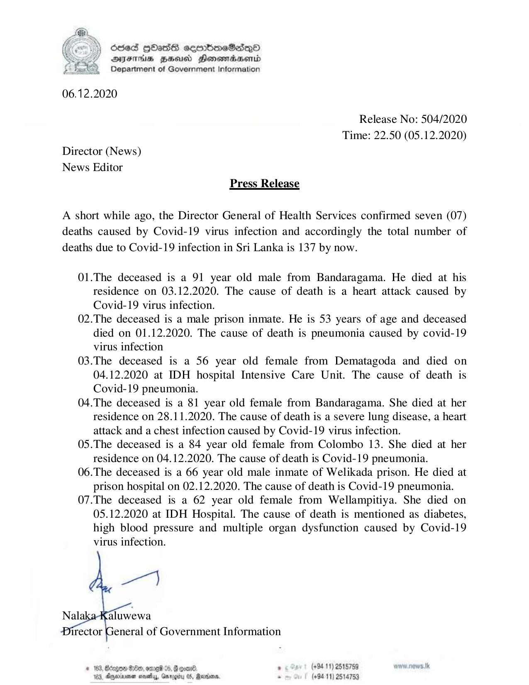

# Press Release - 2020.12.05 - Covid 19 infection deaths rises to 137 
Key: 5b7757210537d2b818008e237b0d2314 

---
```
) ScseS [OATS cseerbmeSdQo
DFS BHU Honomasend
Department of Government Information

  

06.12.2020

Release No: 504/2020

Time: 22.50 (05.12.2020)
Director (News)

News Editor
Press Release

A short while ago, the Director General of Health Services confirmed seven (07)
deaths caused by Covid-19 virus infection and accordingly the total number of
deaths due to Covid-19 infection in Sri Lanka is 137 by now.

01.The deceased is a 91 year old male from Bandaragama. He died at his
residence on 03.12.2020. The cause of death is a heart attack caused by
Covid-19 virus infection.

02.The deceased is a male prison inmate. He is 53 years of age and deceased
died on 01.12.2020. The cause of death is pneumonia caused by covid-19
virus infection

03.The deceased is a 56 year old female from Dematagoda and died on
04.12.2020 at IDH hospital Intensive Care Unit. The cause of death is
Covid-19 pneumonia.

04.The deceased is a 81 year old female from Bandaragama. She died at her
residence on 28.11.2020. The cause of death is a severe lung disease, a heart
attack and a chest infection caused by Covid-19 virus infection.

05.The deceased is a 84 year old female from Colombo 13. She died at her
residence on 04.12.2020. The cause of death is Covid-19 pneumonia.

06.The deceased is a 66 year old male inmate of Welikada prison. He died at
prison hospital on 02.12.2020. The cause of death is Covid-19 pneumonia.

07.The deceased is a 62 year old female from Wellampitiya. She died on
05.12.2020 at IDH Hospital. The cause of death is mentioned as diabetes,
high blood pressure and multiple organ dysfunction caused by Covid-19
virus infection.

  

Nal: aluwewa

eneral of Government Information

 

© 188, Btegen $e, ome 04. Ge . (+9411) 2515759
13, Oyeimmen nova, Grrogiy 05, Renders, - (+9411) 2514753

```
