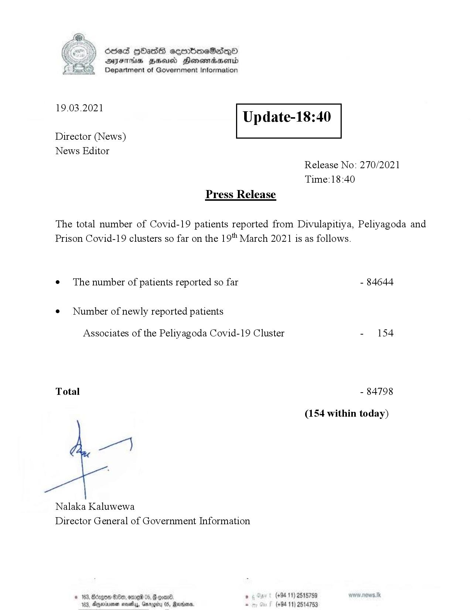

# Press Release - 2021.03.19 
Key: 5bab4ccc327033aa0e780e076ac04830 

---
```
Ssed HbasG sembmeSadqo
DAIS BHU Honomasentd
Department of Government Information

 

 

19.03.2021

Update-18:40

 

 

 

Director (News)
News Editor
Release No: 270/2021
Time:18:40
Press Release

The total number of Covid-19 patients reported from Divulapitiya, Peliyagoda and
Prison Covid-19 clusters so far on the 19" March 2021 is as follows.
e¢ The number of patients reported so far - 84644

¢ Number of newly reported patients

Associates of the Peliyagoda Covid-19 Cluster - 154

Total - 84798

(154 within today)

per]

Nalaka Kaluwewa
Director General of Government Information

oul 5 (+94 11) 2515759
u 05, Rane. . (+94 11) 2514753

© 163, Bdegoe Seo, ome 05,
163, Dgperivenen mosey, Gav

    

```
