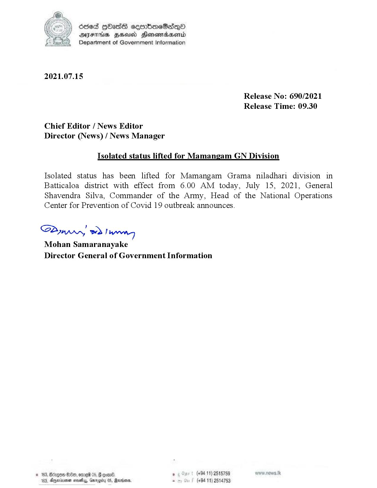

# Press Release - 2021.07.15 - Isolated status lifted for Mamangam GN Division 
Key: 5bc234fc26b8773584626ebc84e60385 

---
```
odes HOasG sembmeSadeqO
AITFIIHS HSU Honowmadsend
Department of Government Information

 

2021.07.15

Release No: 690/2021
Release Time: 09.30

Chief Editor / News Editor
Director (News) / News Manager

Isolated status lifted for Mamangam GN Division

Isolated status has been lifted for Mamangam Grama niladhari division in
Batticaloa district with effect from 6.00 AM today, July 15, 2021, General
Shavendra Silva, Commander of the Army, Head of the National Operations
Center for Prevention of Covid 19 outbreak announces.

Saw) eed Tee
Mohan Samaranayake
Director General of Government Information

. (+94 11) 2515759
(+94 11) 2514753

 

```
