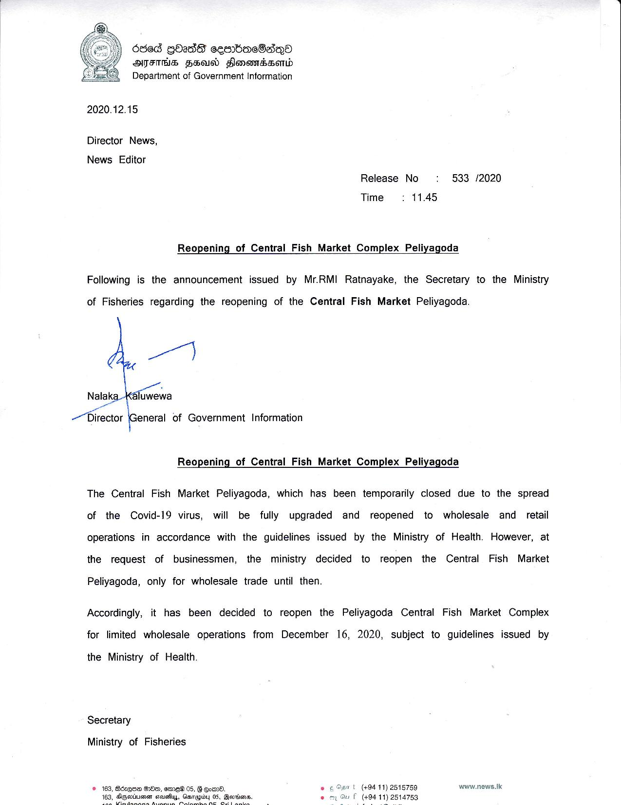

# Press Release - 2020.12.14 - Reopening of Central Fish Market Complex Peliyagoda 
Key: 5c4297aeadb8e51976f7d9d0bfc2a9df 

---
```
686d QOadd cesnbacBabqoa
AFIS FE Honomassonwd
Department of Government Information

 

2020.12.15

Director News,

News Editor
Release No : 533 /2020
Time: 11.45

Reopening of Central Fish Market Complex Peliyagoda

Following is the announcement issued by Mr.RMI Ratnayake, the Secretary to the Ministry

of Fisheries regarding the reopening of the Central Fish Market Peliyagoda.

Nalaka-} sfowewa
a

a :
Director General of Government Information

Reopening of Central Fish Market Complex Peliyagoda

The Central Fish Market Peliyagoda, which has been temporarily closed due to the spread
of the Covid-19 virus, will be fully upgraded and reopened to wholesale and retail
operations in accordance with the guidelines issued by the Ministry of Health. However, at
the request of businessmen, the ministry decided to reopen the Central Fish Market

Peliyagoda, only for wholesale trade until then.

Accordingly, it has been decided to reopen the Peliyagoda Central Fish Market Complex
for limited wholesale operations from December 16, 2020, subject to guidelines issued by

the Ministry of Health.

Secretary

Ministry of Fisheries

vl (494 11) 2515759 www.news.lic
F (#94 11) 2514753

2 Om, ames 05, G om.

     

```
