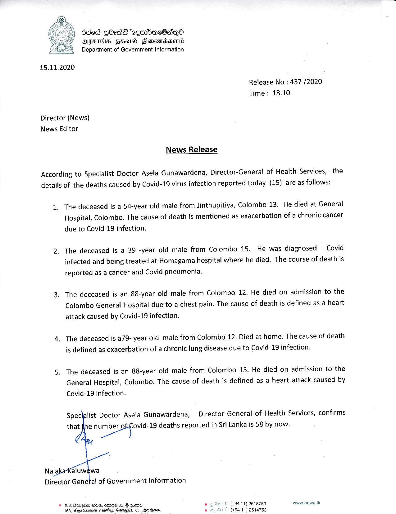

# Press Release - 2020.11.15 -  Covid 19 infection death rises to 58 
Key: 5ca9fdf9b6bdf0b4ef9d05d0426e22b0 

---
```
 

6sed GbadS ‘ceenbeacOaeQ®)
ATS FSaIO Slonensserid
Department of Government Information

15.11.2020

Release No : 437 /2020
Time : 18.10

Director (News)
News Editor

News Release

According to Specialist Doctor Asela Gunawardena, Director-General of Health Services, the
details of the deaths caused by Covid-19 virus infection reported today (15) are as follows:

The deceased is a 54-year old male from Jinthupitiya, Colombo 13. He died at General
Hospital, Colombo. The cause of death is mentioned as exacerbation of a chronic cancer
due to Covid-19 infection.

The deceased is a 39 -year old male from Colombo 15. He was diagnosed Covid
infected and being treated at Homagama hospital where he died. The course of death is
reported as a cancer and Covid pneumonia.

The deceased is an 88-year old male from Colombo 12. He died on admission to the
Colombo General Hospital due to a chest pain. The cause of death is defined as a heart
attack caused by Covid-19 infection.

The deceased is a79- year old male from Colombo 12. Died at home. The cause of death
is defined as exacerbation of a chronic lung disease due to Covid-19 infection.

The deceased is an 88-year old male from Colombo 13. He died on admission to the
General Hospital, Colombo. The cause of death is defined as a heart attack caused by
Covid-19 infection.

Specialist Doctor Asela Gunawardena, Director General of Health Services, confirms
that the as deaths reported in Sri Lanka is 58 by now.

 
 

Director Genetal of Government Information

© 163, Bozqse So, emew 05, G com.

 
  

+ (+94 11) 2515759 www.news.Ik

163, Alqpevinienen sisuefluy, Gesrugtb £ (+94 11) 2514753

 

Qornians.

```
