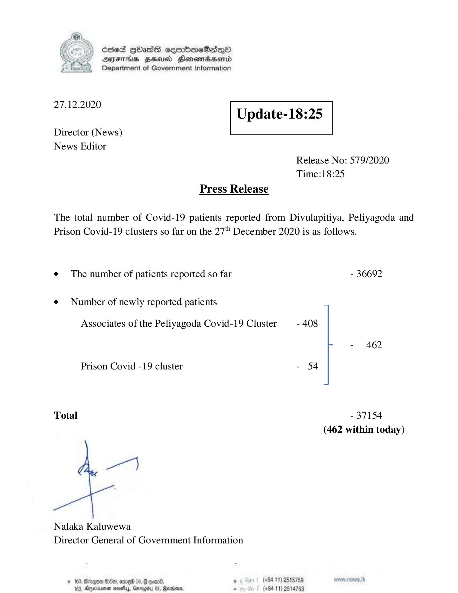

# Press Release - 2020.12.27 
Key: 5cc344341d19d3116ffafbdf111db1e0 

---
```
6563 HOHasG sembmcSasqQo
DAJFITAs BHU Honomrdbsertd
Department of Government Information

 

 

27.12.2020
Update-18:25

 

 

 

Director (News)
News Editor
Release No: 579/2020
Time:18:25
Press Release

The total number of Covid-19 patients reported from Divulapitiya, Peliyagoda and
Prison Covid-19 clusters so far on the 27" December 2020 is as follows.

e The number of patients reported so far - 36692

¢ Number of newly reported patients
Associates of the Peliyagoda Covid-19 Cluster - 408
- 462

Prison Covid -19 cluster - 54

Total - 37154
(462 within today)

Nalaka Kaluwewa
Director General of Government Information

# 163, Bergen 8:00, ome %, Geoan®. , (+84 11) 2515759 pw. news. tk
183, Oryeciarmer mosedlyy, Gnrogcu 05, Marisa. . (+9411) 2514753

```
