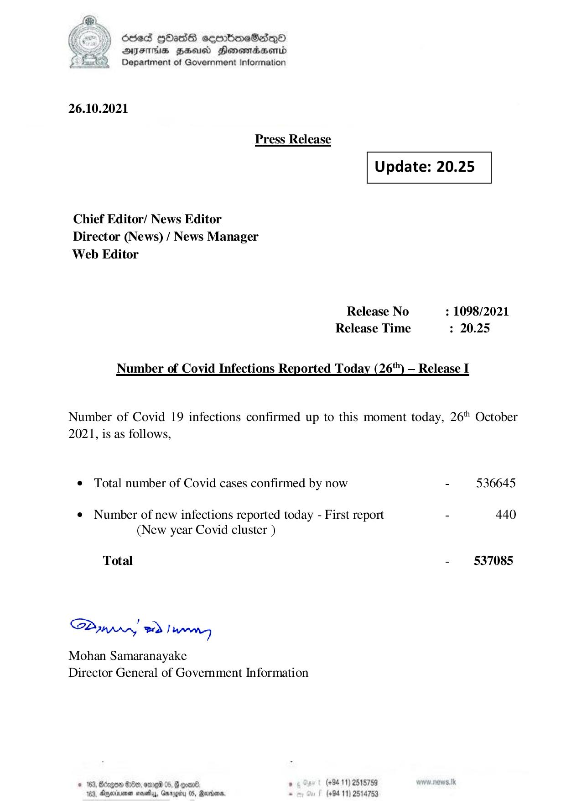

# Press Release - 2021.10.26 
Key: 5d6a62dd6dbb20047e1a1f0d1f47e3df 

---
```
) dcded QOadS seenBboeSiqQo
AIFS HHUCO Honemadaenrd
Department of Government Information

 

26.10.2021

Press Release

 

 

Update: 20.25

 

 

Chief Editor/ News Editor
Director (News) / News Manager
Web Editor

Release No : 1098/2021
Release Time : 20.25

Number of Covid Infections Reported Today (26) — Release I

Number of Covid 19 infections confirmed up to this moment today, 26" October
2021, is as follows,

e Total number of Covid cases confirmed by now - 536645

¢ Number of new infections reported today - First report - 440
(New year Covid cluster )

Total - 537085

SPynpry wd! hawny

Mohan Samaranayake
Director General of Government Information

 

© 163, Bdzgoe $10, ome 05, @ gomn® , (+94 11) 2518759
163. Agywinmen sess, Gnroerty 05, arbors. . (+94 11) 2514753

```
