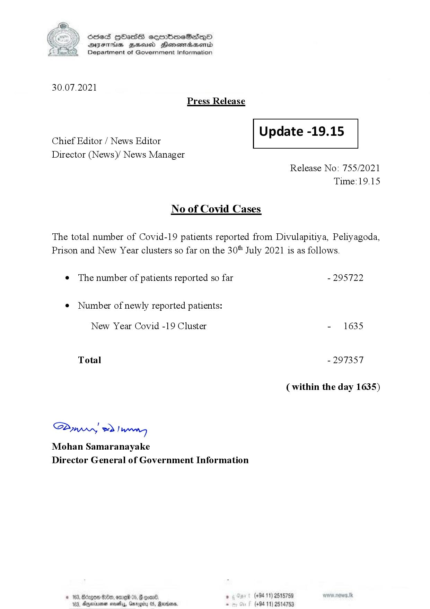

# Press Release - 2021.07.30 
Key: 5d8693eb702bcf3ca985b4cbd1d215f5 

---
```
S) ScseS HOasdS cerrbmeSdQo
SVsThis geod Henssnadasombd
Department of Government Information

 

30.07.2021
Press Release

Chief Editor / News Editor
Director (News)/ News Manager

 

 

Update -19.15

 

 

Release No: 755/2021
Time: 19.15

No of Covid Cases

The total number of Covid-19 patients reported from Divulapitiya, Peliyagoda,

Prison and New Year clusters so far on the 30" July 2021 is as follows.

¢ The number of patients reported so far

¢ Number of newly reported patients:

New Year Covid -19 Cluster

Total

Sw 2) wn
Mohan Samaranayake
Director General of Government Information

© 163, Betegoe S8e, omre 05, # one ,
183, Amevinoman navelay, Garogrty 05, Sardar

- 295722

- 1635

- 297357

(within the day 1635)

(+94 11) 2515759
(+94 11) 2514753

```
